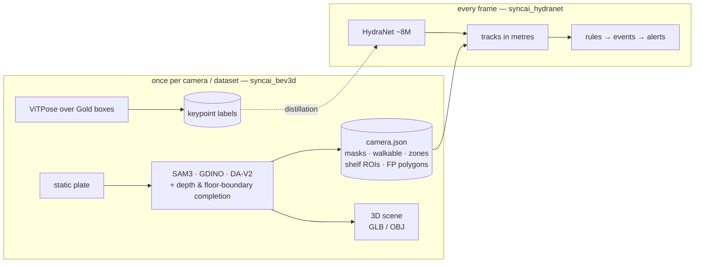

# SyncAI-Lib-HydraNet — security & retail analytics for fixed store CCTV

[](https://github.com/Syncrobotic/SyncAI-Lib-HydraNet/actions/workflows/ci.yml)
[](pyproject.toml)
[](https://pytorch.org/)
[](LICENSE)

One camera, one model, two readings: **loss prevention** (who entered where, what did they
do, did stock leave unpaid) and **retail analytics** (footfall, dwell, paths, queues) from
the fixed CCTV already on the ceiling. No LiDAR, no new hardware.


*Left: person boxes and confirmed tracks, with this camera's false-positive polygons
applied — **staff blue, customers green**, one verdict per person, grey until a track has
been seen long enough to have an opinion. Right: the same moment in metres, the store's own
furniture reconstructed from one static plate, a figure at every tracked shopper's floor
position. Nothing is drawn by hand and no second sensor is involved.*

*Two things to read the panels with. **Every face is blurred by `demo_video.py` itself**,
by two instruments, and `demo_gif.py` then re-runs the detector on the source frames at a
far lower threshold and refuses to write the figure unless every person it finds falls
inside a blurred region — it has refused one (PLAN §7.24). And **the right panel has
fixtures, not a room**: a fixed camera sees part of one store, so the walls are the runs
that were observed rather than a closed boundary, and wall heights are a stated constant
because the depth model collapses on white surfaces.*

**A second store**, same code, same audit:


*The staff colours are licensed per camera and refused where they are not earned: this one
scores 1.00 held out on 15 labelled crops, and the same model is refused on Tao-Hsin-cam04
at 0.417 — that store's figure is rendered without them and says so, rather than colouring
half its staff as shoppers (PLAN §7.23).*

The whole plan — architecture, data strategy, build order, and the measurements behind
every decision — lives in **one document: [docs/PLAN.md](docs/PLAN.md)**. Everything the
project previously documented is in git history (`git show b7457c2:docs/<file>`).

## The design in one paragraph

Two packages with one contract between them. `syncai_bev3d` runs **once per camera**: it
builds a static plate, fits the ground geometry, runs the teachers one time, and emits a
`camera.json` — walkable floor, walls, columns, doors, display tables and shelves,
products down to `iphone / ipad / macbook / boxed_stock`, shelf ROIs, and the derived
false-positive polygons. The same artefacts render a metric 3D scene per camera, exported
as `scene.glb` / `scene.obj`. `syncai_hydranet` runs **every frame**: a shared
RegNetX-800MF + BiFPN trunk with two heads — detection (`person`, `bag`, `device`,
`boxed_stock`) and pose (17 keypoint heatmaps at P3, decoded inside the detection boxes) —
whose boxes become tracks *in metres* through the cached geometry. Everything above that
is rules, a tiny temporal model, and a VLM on trigger.

**Anything constant on a fixed camera is cached, never learned; only what changes
frame-to-frame spends the GPU.** The boundary is enforced rather than remembered:
`tests/test_package_boundaries.py` fails if a serving-path module ever imports
`syncai_bev3d`.

## Two model suites, one product

The project runs **two very different kinds of model**, and confusing them is the
classic failure this architecture exists to prevent:

| | the **teachers** (`syncai_bev3d`) | the **student** (`syncai_hydranet`) |
|---|---|---|
| models | SAM 3, Grounding DINO, Depth-Anything V2, ViTPose — hundreds of millions to billions of parameters | one HydraNet, **~8 M parameters** |
| when | **once per camera** (commissioning) and **once per dataset** (labelling) | **every frame, 96 streams × 5 fps** |
| where the answers go | cached: `camera.json`, masks, keypoint files | inferred: boxes + keypoints per frame |
| allowed to be slow | yes — 40 s per plate is fine | no — the whole budget is 480 frames/s (PLAN §7.4) |



## Install & run

```bash
uv sync                                        # or: pip install -e .
hydranet-train --config configs/<config>.yaml  # train
hydranet-eval --config configs/<config>.yaml   # evaluate
hydranet-infer-video ...                       # overlay inference on a clip
hydranet-export-onnx ...                       # ONNX for the TensorRT path
```

Entry points: `hydranet-train`, `hydranet-eval`, `hydranet-infer-image`,
`hydranet-infer-video`, `hydranet-scene`, `hydranet-export-onnx`, `hydranet-annotation`,
`hydranet-report` (see `pyproject.toml`).

## Layout

| path | what |
|---|---|
| `src/syncai_bev3d/` | commissioning: calibration fitting, plate pipeline, SAM 3 / Grounding DINO teachers, BEV & scene rendering — runs once per camera |
| `src/syncai_hydranet/` | the per-frame side: models, training engine, data, runtime geometry + the `camera.json` contract, serving, analytics |
| `configs/` | training configs — `config.yaml` inside a run directory is the only authoritative record of what a run trained on |
| `docs/PLAN.md` | the plan; the single source of truth |
| `tools/commissioning/` | the per-camera pipeline: metre-grid verification, structure masks, depth completion, product subclasses, false-positive polygons, and the 3D scene renders (`scene_mesh.py` → GLB/OBJ). `masks_diagnose.py` and `cluster_rules.py` are its instruments: the first keeps the per-cluster verdict the pipeline otherwise prints as a total, the second replays those cached proposals through a different rule with no GPU |
| `tools/pose/` | the ViTPose teacher run that labels the Gold boxes for the pose head |
| `tools/site30k/`, `scripts/` | campaign tooling, static plates, teachers' CLI front ends, and the measurement instruments a claim in this file rests on — `track_review.py` (turn track ground truth into minutes of judgement), `track_idf1.py` (both trackers over one inference pass), `zone_dwell.py` (does a visit survive the tracker) |
| `datasets/`, `runs/`, `exports/`, `weights/` | data and artefacts (largely gitignored) |

## Credits

**Teachers.** The commissioning pass runs four published models once per camera and caches
their answers; none of them is in the serving path. Each is pinned to an exact commit in
`src/syncai_bev3d/teachers/` and `tools/pose/`.

| model | used for |
|---|---|
| [SAM 3](https://huggingface.co/facebook/sam3) (Meta) | promptable segmentation of the static plate — fixtures, floor, products |
| [Grounding DINO](https://huggingface.co/IDEA-Research/grounding-dino-base) (IDEA Research) | open-vocabulary boxes, and the `person` proposals the student is distilled from |
| [Depth-Anything V2 Metric Indoor](https://huggingface.co/depth-anything/Depth-Anything-V2-Metric-Indoor-Large-hf) | fixture heights where the depth holds |
| [ViTPose](https://huggingface.co/usyd-community/vitpose-base-simple) (USyd) | the 17-keypoint labels the pose head is trained against |

**Datasets.** Public sets used for pre-training, mixing and evaluation:
[ADE20K](https://groups.csail.mit.edu/vision/datasets/ADE20K/) ·
[COCO](https://cocodataset.org/) and
[COCO-Stuff](https://github.com/nightrome/cocostuff) ·
[HM3D](https://aihabitat.org/datasets/hm3d/) ·
[NYU Depth v2](https://cs.nyu.edu/~silberman/datasets/nyu_depth_v2.html) ·
[RAP v2](https://www.rapdataset.com/) ·
[PA-100K](https://github.com/xh-liu/HydraPlus-Net) ·
[PETA](http://mmlab.ie.cuhk.edu.hk/projects/PETA.html) ·
[Market-1501](https://zheng-lab.cecs.anu.edu.au/Project/project_reid.html) ·
[PoseLift](https://github.com/TeCSAR-UNCC/PoseLift). Each keeps its own licence and terms;
this repository redistributes none of them.

**Store footage.** Every frame of a shop in this repository comes from the deployment
partner's own cameras, is used with their permission, and has every face blurred by
`demo_video.py` before the file exists — see the figure caption above. Raw clips and plates
are gitignored and are not redistributed.

## Licence

Apache-2.0. See [LICENSE](LICENSE) and [CITATION.cff](CITATION.cff).
