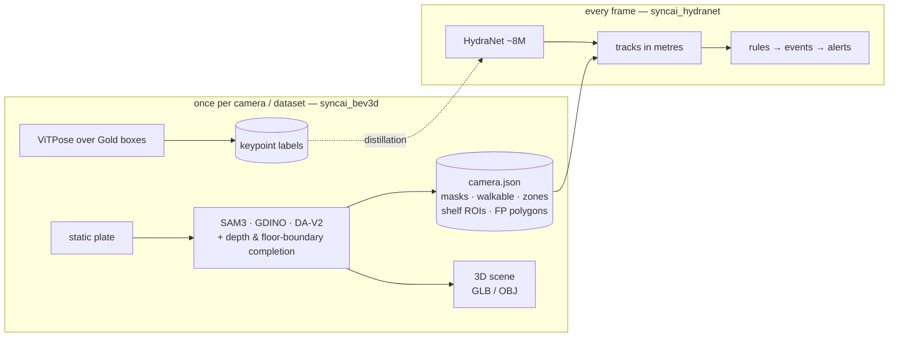

# SyncAI-Lib-HydraNet — security & retail analytics for fixed store CCTV

[](https://github.com/Syncrobotic/SyncAI-Lib-HydraNet/actions/workflows/ci.yml)
[](pyproject.toml)
[](https://pytorch.org/)
[](LICENSE)

One camera, one model, two readings: **loss prevention** (who entered where, what did they
do, did stock leave unpaid) and **retail analytics** (footfall, dwell, paths, queues) from
the fixed CCTV already on the ceiling. No LiDAR, no new hardware.

The whole plan — architecture, data strategy, build order, and the measurements behind
every decision — lives in **one document: [docs/PLAN.md](docs/PLAN.md)**. Everything the
project previously documented is in git history (`git show b7457c2:docs/<file>`).

## The design in one paragraph

Two packages with one contract between them. `syncai_bev3d` runs **once per camera**: it
builds a static plate, fits the ground geometry, runs the teachers (SAM 3 + Grounding
DINO) one time, completes what they miss from depth and floor-boundary geometry, and
emits a `camera.json` — walkable floor, walls, columns, doors, display tables and
shelves, products down to `iphone / ipad / macbook / boxed_stock`, shelf ROIs, and the
derived false-positive polygons (glass stays a human-drawn polygon: 112 frames of
measurement say no teacher can be trusted with it). The same artefacts render a metric
3D scene per camera — solid furniture at depth-measured heights, exported as
`scene.glb`/`scene.obj` for any real renderer. `syncai_hydranet` runs **every frame**: a
shared RegNetX-800MF + BiFPN trunk with two heads — detection (`person`, `bag`,
`device`, `boxed_stock`) and pose (17 keypoint heatmaps at P3, decoded inside the
detection boxes) — whose boxes become tracks *in metres* through the cached geometry.
Everything above that is rules, a tiny temporal model, and a VLM on trigger. Anything
constant on a fixed camera is cached, never learned; only what changes frame-to-frame
spends the GPU. The boundary is enforced, not remembered:
`tests/test_package_boundaries.py` fails if a serving-path module ever imports
`syncai_bev3d`.

## Two model suites, one product

The project runs **two very different kinds of model**, and confusing them is the
classic failure this architecture exists to prevent:

| | the **teachers** (`syncai_bev3d`) | the **student** (`syncai_hydranet`) |
|---|---|---|
| models | SAM 3, Grounding DINO, Depth-Anything V2, ViTPose — hundreds of millions to billions of parameters | one HydraNet, **~8 M parameters** |
| when | **once per camera** (commissioning) and **once per dataset** (labelling) | **every frame, 96 streams × 5 fps** |
| where the answers go | cached: `camera.json`, masks, keypoint files | inferred: boxes + keypoints per frame |
| allowed to be slow | yes — 40 s per plate is fine | no — the whole budget is 480 frames/s (PLAN §7.4) |



## The network


Measured (PLAN §2.2): the shared trunk buys a second per-frame task for **+3%
throughput**; two separate networks cost **+74%**. The forward graph is pure
convolution — NMS and keypoint decoding live in post-processing, which is what keeps
the ONNX → TensorRT export clean: **1,494 fps** at batch 16, fp16, pose resident, on an
idle PRO 6000 — 3.1× the 480 f/s the delivery target asks for (PLAN §6 step 3, §7.4).

## Install & run

```bash
uv sync                                        # or: pip install -e .
hydranet-train --config configs/<config>.yaml  # train
hydranet-eval --config configs/<config>.yaml   # evaluate
hydranet-infer-video ...                       # overlay inference on a clip
hydranet-export-onnx ...                       # ONNX for the TensorRT path
```

Entry points: `hydranet-train`, `hydranet-eval`, `hydranet-infer-image`,
`hydranet-infer-video`, `hydranet-scene`, `hydranet-export-onnx`, `hydranet-annotation`,
`hydranet-report` (see `pyproject.toml`).

## Layout

| path | what |
|---|---|
| `src/syncai_bev3d/` | commissioning: calibration fitting, plate pipeline, SAM 3 / Grounding DINO teachers, BEV & scene rendering — runs once per camera |
| `src/syncai_hydranet/` | the per-frame side: models, training engine, data, runtime geometry + the `camera.json` contract, serving, analytics |
| `configs/` | training configs — `config.yaml` inside a run directory is the only authoritative record of what a run trained on |
| `docs/PLAN.md` | the plan; the single source of truth |
| `tools/commissioning/` | the per-camera pipeline: metre-grid verification, structure masks, depth completion, product subclasses, false-positive polygons, and the 3D scene renders (`scene_mesh.py` → GLB/OBJ) |
| `tools/pose/` | the ViTPose teacher run that labels the Gold boxes for the pose head |
| `tools/site30k/`, `scripts/` | campaign tooling, static plates, teachers' CLI front ends |
| `datasets/`, `runs/`, `exports/`, `weights/` | data and artefacts (largely gitignored) |

## Licence

Apache-2.0. See [LICENSE](LICENSE) and [CITATION.cff](CITATION.cff).
