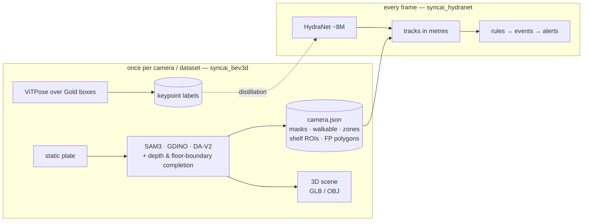
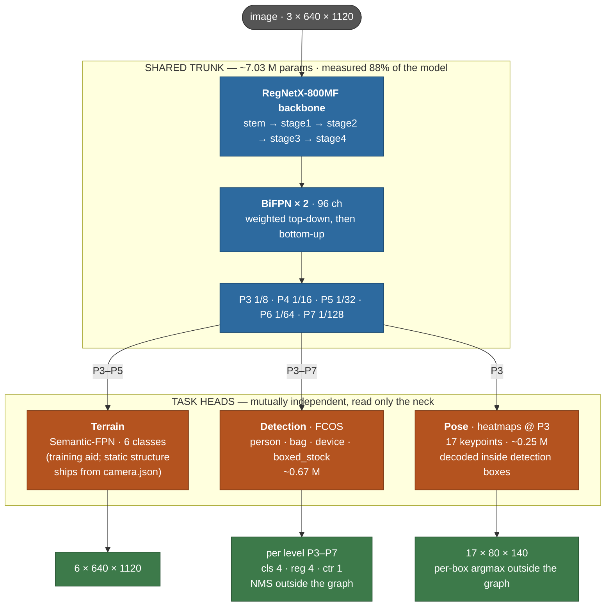

# SyncAI-Lib-HydraNet — security & retail analytics for fixed store CCTV

[](https://github.com/Syncrobotic/SyncAI-Lib-HydraNet/actions/workflows/ci.yml)
[](pyproject.toml)
[](https://pytorch.org/)
[](LICENSE)

One camera, one model, two readings: **loss prevention** (who entered where, what did they
do, did stock leave unpaid) and **retail analytics** (footfall, dwell, paths, queues) from
the fixed CCTV already on the ceiling. No LiDAR, no new hardware.


*One camera, both readings. Left: person boxes and confirmed tracks, with the camera's
false-positive polygons already applied. Right: the same moment in metres — the store's
own furniture reconstructed from one static plate, with a figure standing at every
tracked shopper's floor position. Nothing here is drawn by hand and no second sensor is
involved. **Read the metres on this camera with its caveat**: Taichung-cam10's scale is
known to be 1.21x too large (PLAN §7.10, a decision to leave it rather than an
oversight), which is why its figures stand 1.98 m rather than 1.70.*

The whole plan — architecture, data strategy, build order, and the measurements behind
every decision — lives in **one document: [docs/PLAN.md](docs/PLAN.md)**. Everything the
project previously documented is in git history (`git show b7457c2:docs/<file>`).

## The design in one paragraph

Two packages with one contract between them. `syncai_bev3d` runs **once per camera**: it
builds a static plate, fits the ground geometry, runs the teachers (SAM 3 + Grounding
DINO) one time, completes what they miss from depth and floor-boundary geometry, and
emits a `camera.json` — walkable floor, walls, columns, doors, display tables and
shelves, products down to `iphone / ipad / macbook / boxed_stock`, shelf ROIs, and the
derived false-positive polygons (glass stays a human-drawn polygon: 112 frames of
measurement say no teacher can be trusted with it). The same artefacts render a metric
3D scene per camera — solid furniture, tables and shelves at their measured heights and
walls and columns at a stated constant because the depth model collapses on large white
surfaces, exported as `scene.glb`/`scene.obj` for any real renderer. **How much of a shop
that scene contains depends on what the shop is made of**: on the five cameras whose
fixtures are wood or dark laminate it is most of the room, and on the two whose fixtures
are white it is about a third, because both teachers read a white counter as a wall
(PLAN §7.21 measures it — the counters *are* proposed, at `table 0.945` inside a cluster
that wins `wall 0.969`, and no clustering or paint-order change moves that camera's map
by a pixel). `syncai_hydranet` runs **every frame**: a
shared RegNetX-800MF + BiFPN trunk with two heads — detection (`person`, `bag`,
`device`, `boxed_stock`) and pose (17 keypoint heatmaps at P3, decoded inside the
detection boxes) — whose boxes become tracks *in metres* through the cached geometry.
Everything above that is rules, a tiny temporal model, and a VLM on trigger. Anything
constant on a fixed camera is cached, never learned; only what changes frame-to-frame
spends the GPU. The boundary is enforced, not remembered:
`tests/test_package_boundaries.py` fails if a serving-path module ever imports
`syncai_bev3d`.

## Two model suites, one product

The project runs **two very different kinds of model**, and confusing them is the
classic failure this architecture exists to prevent:

| | the **teachers** (`syncai_bev3d`) | the **student** (`syncai_hydranet`) |
|---|---|---|
| models | SAM 3, Grounding DINO, Depth-Anything V2, ViTPose — hundreds of millions to billions of parameters | one HydraNet, **~8 M parameters** |
| when | **once per camera** (commissioning) and **once per dataset** (labelling) | **every frame, 96 streams × 5 fps** |
| where the answers go | cached: `camera.json`, masks, keypoint files | inferred: boxes + keypoints per frame |
| allowed to be slow | yes — 40 s per plate is fine | no — the whole budget is 480 frames/s (PLAN §7.4) |



## The network



Measured (PLAN §2.2): the shared trunk buys a second per-frame task for **+3%
throughput**; two separate networks cost **+74%**. The forward graph is pure
convolution — NMS and keypoint decoding live in post-processing, which is what keeps
the ONNX → TensorRT export clean: **1,494 fps** at batch 16, fp16, pose resident, on an
idle PRO 6000 — 3.1× the 480 f/s the delivery target asks for (PLAN §6 step 3, §7.4).

## What is measured, and what is not yet

Every number in this README and in the plan is a measurement with the run behind it, and
the honest summary of where the product stands is that **the per-frame model is done and
the identity layer above it is not**.

Verified, with the artefact:

* **Pose** — PCK@0.2h **0.915**, L2 median **7.7 px** against a ViTPose teacher on a
  2,862-image held-out split (PLAN §6 step 3).
* **Throughput** — **1,494 f/s** end to end on an idle PRO 6000, 3.1× the target.
* **Geometry** — our chain reproduces WILDTRACK's floor positions to a median **7.3 cm**
  over 19,824 person-observations on 7 cameras (§7.13).
* **Behaviour** — a 32,933-parameter temporal model beats the geometric rule it replaces
  on all five NTU action pairs, held out **by performer** (§7.17).

Not yet, and the gap is `dwell`, which the first paragraph of this README sells:

> **A visit does not survive the tracker on every camera.** Measured 2026-08-28 on two
> hand-read clips (§7.18): on Taichung-cam01 the truth is 35 zone visits and the shipped
> tracker reports 35, keeping 5 of 6 loiters whole. On Tao-Hsin-cam03 the truth is **4
> visits totalling 68.6 s** and the shipped tracker reports **17 totalling 42.2 s** — and
> its one real loiter, a member of staff at a counter for **57.6 s**, arrives at the event
> layer as **thirteen visits whose longest is 4.8 s**. Any dwell rule with a threshold
> above five seconds cannot fire on that camera at all.

Two-stage association improves it and does not fix it (that loiter goes from 8% to 42% of
its true length, and identity precision rises on both clips, so it is safe to adopt).
What closes the gap is an appearance model that can re-link a shopper across a 5–12 second
absence — and the same two clips price the difficulty as well as the prize: **26% and 49%
of the labelled boxes are lost to fragmentation** under a one-to-one identity mapping,
while the people it has to tell apart are wearing the same uniform.

## Install & run

```bash
uv sync                                        # or: pip install -e .
hydranet-train --config configs/<config>.yaml  # train
hydranet-eval --config configs/<config>.yaml   # evaluate
hydranet-infer-video ...                       # overlay inference on a clip
hydranet-export-onnx ...                       # ONNX for the TensorRT path
```

Entry points: `hydranet-train`, `hydranet-eval`, `hydranet-infer-image`,
`hydranet-infer-video`, `hydranet-scene`, `hydranet-export-onnx`, `hydranet-annotation`,
`hydranet-report` (see `pyproject.toml`).

## Layout

| path | what |
|---|---|
| `src/syncai_bev3d/` | commissioning: calibration fitting, plate pipeline, SAM 3 / Grounding DINO teachers, BEV & scene rendering — runs once per camera |
| `src/syncai_hydranet/` | the per-frame side: models, training engine, data, runtime geometry + the `camera.json` contract, serving, analytics |
| `configs/` | training configs — `config.yaml` inside a run directory is the only authoritative record of what a run trained on |
| `docs/PLAN.md` | the plan; the single source of truth |
| `tools/commissioning/` | the per-camera pipeline: metre-grid verification, structure masks, depth completion, product subclasses, false-positive polygons, and the 3D scene renders (`scene_mesh.py` → GLB/OBJ). `masks_diagnose.py` and `cluster_rules.py` are its instruments: the first keeps the per-cluster verdict the pipeline otherwise prints as a total, the second replays those cached proposals through a different rule with no GPU |
| `tools/pose/` | the ViTPose teacher run that labels the Gold boxes for the pose head |
| `tools/site30k/`, `scripts/` | campaign tooling, static plates, teachers' CLI front ends, and the measurement instruments a claim in this file rests on — `track_review.py` (turn track ground truth into minutes of judgement), `track_idf1.py` (both trackers over one inference pass), `zone_dwell.py` (does a visit survive the tracker) |
| `datasets/`, `runs/`, `exports/`, `weights/` | data and artefacts (largely gitignored) |

## Licence

Apache-2.0. See [LICENSE](LICENSE) and [CITATION.cff](CITATION.cff).
