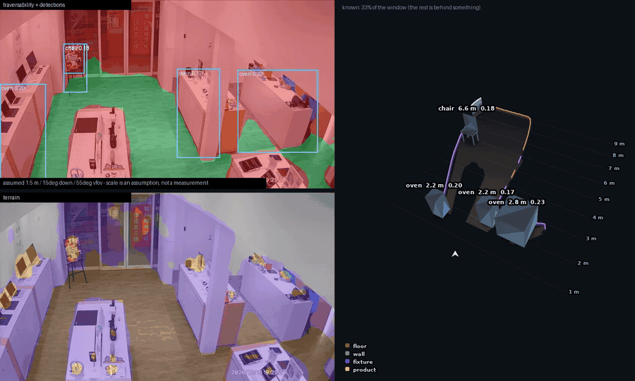

# SyncAI-Lib-HydraNet — multi-task perception for fixed store CCTV

[](https://github.com/Syncrobotic/SyncAI-Lib-HydraNet/actions/workflows/ci.yml)
[](pyproject.toml)
[](https://pytorch.org/)
[](LICENSE)

Multi-head perception network: **one forward pass, one frame, several outputs — traversable
surface, terrain class, object detection, and now depth.** The architecture follows the
Tesla HydraNet idea: a shared backbone and neck carry almost all of the compute, while the
task heads stay tiny and mutually independent.

**One product: fixed store CCTV.** One camera answers both halves of the ask — retail
analytics (*what merchandise, where do people go, how long do they stay*) and security
(*who entered where, how many, what did they do*) — off one model, one export and one
latency budget. It runs server-side, TensorRT on an AGX Orin.

> **A quadruped line was removed on 2026-08-19.** It shared this core and shipped RKNN to a
> Lite3's RK3588 NPU. It is in the history, not the tree. What it left behind is documented
> in the commit that removed it — including the pieces that turned out to be shared and
> stayed: the geometry module, the traversability head, the indoor taxonomy and the depth
> head all serve the camera too, and none of them moved.

## What it does, on a real store camera



Every head on one frame of `Tao-Hsin-cam03`: free space with detections top left, the
seven-class terrain map bottom left, and the floor rebuilt as a scene on the right. The
panel raises the edge of the free space into a wall and colours it by what the terrain head
says is standing there — purple display fixtures, grey wall, pink people — which is the
part a flat occupancy map cannot express: it marks the cell blocked and stops. Object boxes
get their footprint from the two bottom corners projected onto the floor and their height
from the top edge's ray, so those are derived rather than nominal.

**`Tao-Hsin-cam03` is a held-out camera.** The split in `datasets/retail_objects_batch02`
is by camera, not by frame, so no view of this room was trained on; the clip is also from
a different hour than the two archives that were sampled. That is what makes the picture
evidence of anything. It knows **26% of its window** and the rest is behind something,
which is the number to carry rather than the geometry.

**Two things it still does not show.** There is **no traversability head** in this config:
the free space top left is derived from the terrain map through the taxonomy's own table,
so it can be no better than the terrain classes it is read off. And every object label
carries its score for a reason — the detection head's vocabulary is COCO's 80, which has no
noun for a display case, so a demo counter comes back as `oven 0.20`. The boxes are in the
right places; only the names are wrong. `hydranet-infer-image --vocab retail` reads them
back as shop nouns, and `hydranet-scene` does not offer that yet.

**Three things in this picture are weaker than they look.**
The camera pose was recovered by fitting 287 detected people against a 1.70 m adult, and the
fit is a *family*, not a point — the residual falls monotonically as the assumed field of
view widens, because a pinhole model absorbs this lens's barrel distortion. Shape, direction
and the ordering of ranges hold; absolute distance does not, and one tape measure on site
would settle it.
The **wall heights are drawn, not measured** — a wall is 2.4 m tall here because walls are
about that. Only the position of the boundary comes from the mask.
And the floor itself is not solved: over 610 frames of this fixed camera the model returns
`go` consistently for only **12.7%** of the frame, while **16.7%** flickers between walkable
and blocked — concentrated on the brighter, more specular near-field tiles, which is the
polished-floor failure [docs/RETAIL.md](docs/RETAIL.md) predicts. No public
dataset fixes that one; a fixed camera makes it one annotated polygon per view.


## The network


Shapes above are for the default `input_size: [512, 640]`; the segmentation heads always
resize their logits back to the input resolution, so the two mask outputs match the image
whatever it is set to.

The parameter split bears the design out: **84.4% shared trunk, 15.6% for all three heads
combined** (8,316,434 total). A fourth head costs roughly 3–9% more parameters and reuses
the 84% already paid for.

- **Backbone**: torchvision RegNetX, swappable to ResNet18/34/50 with one config key
- **Neck**: BiFPN (fast-normalized fusion), with plain FPN as the alternative
- **Head 1, traversability**: Semantic-FPN style segmentation, 3 classes
- **Head 2, terrain**: the same segmentation head, 12 classes
- **Head 3, detection**: FCOS, anchor-free (focal + GIoU + centerness)
- **Multi-task balancing**: Kendall learned uncertainty weighting (or fixed weights)
- **Partial supervision across datasets**: each step draws a batch from a single dataset and
  backpropagates only the losses of the heads that dataset supervises
- **One annotation, two heads**: terrain labels generate traversability labels via a policy table
- **TensorRT friendly**: the forward graph is only Conv/BN/ReLU/Resize/MaxPool/Exp/Mul; NMS
  lives in post-processing

## Installation

The project uses [uv](https://docs.astral.sh/uv/) for environments and dependencies.

```bash
uv sync --group dev --extra export   # create .venv and install everything
uv run pytest                        # smoke tests, no dataset required
```

Training, evaluation and inference all pick CUDA → MPS → CPU automatically.

```bash
uv run hydranet-prepare-ade20k --src datasets/ADEChallengeData2016 --dst datasets/ADE20K \
    --test-fraction 0.5
uv run hydranet-train --config configs/hydranet_indoor.yaml
uv run hydranet-eval  --config configs/hydranet_indoor.yaml \
    --checkpoint runs/hydranet_indoor/best.pt --split test
```

## Where to look

Nine documents, down from seventeen — merged 2026-08-19 because the boundaries between them
had stopped matching the work.

| If you are | Read |
|---|---|
| working the **main line** | [docs/RETAIL.md](docs/RETAIL.md) — the output contract, the taxonomies, behaviour split by the instrument that can resolve it, and what stays out of the weights |
| working on its **data** | [docs/RETAIL_DATA.md](docs/RETAIL_DATA.md) — the split rules, the camera roles, the teacher models, and why every site number is an *agreement* rather than an accuracy |
| running or learning it | [docs/TRAINING_GUIDE.md](docs/TRAINING_GUIDE.md) — why it is shaped this way, which measurements lie, and (§9) how to actually run it |
| picking it up as a team | [docs/METHODOLOGY.md](docs/METHODOLOGY.md) — dividing the work, what data to collect, how labels get made, the four levels of evaluation |
| changing the architecture | [docs/ARCHITECTURE.md](docs/ARCHITECTURE.md) — Part I the measured verdicts (two since overturned, marked in place), Part II where the CCTV line goes |
| deploying | [docs/DEPLOY.md](docs/DEPLOY.md) — the export contract, board bring-up from scratch, and local development on a Mac |
| shipping a version | [docs/RELEASE.md](docs/RELEASE.md) — `dev → stage → main`, and separately how a *model* gets a version |
| turning a mask into metres | [docs/GROUND_PROJECTION.md](docs/GROUND_PROJECTION.md) |

`docs/journal/` holds dated notes from particular days. They are records, not documentation
— accurate about the day they describe and not maintained afterwards, so their links to the
pre-merge filenames are left as they were written. Each merged document names its sources in
its own header, which is how to find where a journal's citation went. The newest is
[2026-08-19](docs/journal/2026-08-19-security-retail-teachers-and-methodology.md).

## Commands

Installation provides these console scripts:

| Command | Purpose |
|---|---|
| `hydranet-train` | Training |
| `hydranet-eval` | Run validation on a checkpoint |
| `hydranet-infer-image` | Overlay inference on a single image or a folder |
| `hydranet-infer-video` | Video inference (uses the system ffmpeg, no opencv needed) |
| `hydranet-scene` | Project a frame or clip onto the floor in metres — the panel above, and the scene as JSON |
| `hydranet-export-onnx` | Export ONNX for TensorRT — see the deployment flags below |
| `hydranet-prepare-ade20k` | Filter ADE20K to its indoor subset and lay it out as `seg_folder` |
| `hydranet-prepare-cocostuff` | The same, for COCO-Stuff's segmentation labels over the COCO images |
| `hydranet-report` | Summarise one run, or rank runs and diff their configs |
| `hydranet-annotation` | Emit the CVAT label schema; gate an annotated dataset before training on it |

Run them all with `uv run <command>`, or `source .venv/bin/activate` first.

### Two export flags worth knowing before you benchmark

Neither changes the model. The weights are untouched, nothing is retrained, and the network
graph is identical — what changes is how much work leaves the GPU for the host to redo.

| flag | what it does |
|---|---|
| `--argmax-seg` | segmentation heads emit uint8 class maps instead of float logits; the host stops doing the argmax and D2H drops from 9.18 MB to 0.33 MB |
| `--detection-classes robot_8\|retail_analytics\|<names>` | keeps only the class channels the deployment reads, out of a head still trained on all 80 |

Measured end to end on a GB10 at 512×640 (±15%, shared GPU; the ratios held across three
repeats): **6.69 ms → 3.29 ms**, and **2.25 ms / 444 fps** with a CUDA graph
(`live_view_orin.py --cuda-graph`).

> `--argmax-seg` makes the *engine* slower, 2.09 → 2.71 ms — the work moved onto the GPU,
> where it is cheap. Benchmarked with `trtexec` alone it looks like a 25% regression. It is
> a whole-frame win and cannot be seen from the engine.

Both rename the bindings they change (`terrain_argmax`, `det_cls8_p3`), so a runtime
written for the old contract fails to find its binding rather than misreading it, and
`--detection-classes` writes a `<output>.classes.json` sidecar because a TensorRT engine
keeps binding names and nothing else. Full tables and the correctness checks are in
[DEPLOY.md](docs/DEPLOY.md).

## Deployment configs

| Config | Environment | Terrain classes | Segmentation datasets |
|---|---|---|---|
| `hydranet_regnet800mf.yaml` | Off-road | 12 outdoor (grass / gravel / tree-bush …) | RUGD, RELLIS-3D |
| `hydranet_indoor.yaml` | Indoor (lobbies / corridors / factory floors) | 12 indoor (floor / glass / stairs …) | ADE20K + your own annotations |
| `hydranet_retail.yaml` | Retail (shops / supermarkets) | the indoor 12 + `display_fixture` | ADE20K + store footage |

Model structure, losses and training mechanics are identical across all three — the
differences are `data.terrain_classes`, `label_map` and the data sources. All three use
COCO for the detection head, unchanged.

`configs/` holds more, each narrower than a deployment: `hydranet_retail_objects.yaml` (the
second retail taxonomy — objects rather than traversability, argued in
[RETAIL.md](docs/RETAIL.md)), `hydranet_retail_cctv.yaml` (the fixed-camera
fine-tune at 512×896), `hydranet_retail_cocostuff.yaml` and
`hydranet_retail_objects_nc2.yaml` (one-variable experiments, each naming in the file the
control it must be read against), and `eval_indoor25.yaml`, which is an evaluation rather
than a training run — it reproduces the 0.3246 indoor-subset detection baseline in one
command, with the expected numbers written in the file you would run.

Each inherits `configs/_base/hydranet.yaml`, so a config file contains only what makes
that deployment different. What is *not* in a file comes from the base, and the run's
`meta.json` records the merged result.
Label schemes are defined in `SCHEMES` in
[`label_maps.py`](src/syncai_hydranet/data/label_maps.py); the indoor mapping is in
[`label_maps_indoor.py`](src/syncai_hydranet/data/label_maps_indoor.py).

If your camera's aspect ratio differs from `input_size`, turn on `data.letterbox: true`
(a portrait phone video squeezed straight into the input is compressed more than 2× horizontally).

## Adding a task head (worked example: monocular depth)

This was hypothetical until `heads/depth.py` landed, so the steps below are now a
description of something in the tree rather than a plan — read `depth_fpn` in
[`hydranet.py`](src/syncai_hydranet/models/hydranet.py) and
[`configs/hydranet_hm3d_cctv.yaml`](configs/hydranet_hm3d_cctv.yaml) alongside them.

1. Add the head module under `src/syncai_hydranet/models/heads/` (it takes the FPN feature list)
2. Register the type branch in `hydranet.py::HydraNet.__init__` and add its loss in `compute_losses`
3. Add a `model.heads` section to the config, and list the new head under the relevant
   dataset's `supervises`

Heads are mutually independent, so this does not affect training or deployment of the
existing ones.

## Development

```bash
uv run ruff check --fix .    # lint + import sorting
uv run ruff format .         # formatting
uv run pytest --cov          # tests + coverage
uv run pre-commit install    # enable pre-commit checks
```

CI runs lint plus a Python 3.10 / 3.12 test matrix on GitHub Actions, and fails below 80%
coverage (currently 87% across 1,300+ tests). The tests need no datasets: model tests run on
random tensors, dataset tests build
a fixture in `tmp_path`, and `test_overfit.py` verifies the training loop really converges by
memorising one synthetic batch to over 95% pixel accuracy (chance is 33% across three classes).

## Project layout

```text
src/syncai_hydranet/
├── config.py                 # YAML config + dot-path overrides
├── config_schema.py          # config validation: unknown keys, types, cross-field consistency
├── cli/                      # console script entry points (train/eval/infer/export/report)
├── models/
│   ├── backbone.py           # RegNet / ResNet multi-scale features
│   ├── neck.py               # BiFPN / FPN
│   ├── heads/segmentation.py # Semantic-FPN segmentation head (shared by both seg heads)
│   ├── heads/detection.py    # FCOS head + target assignment + decode/NMS
│   ├── heads/depth.py        # Semantic-FPN-shaped depth head, SILog loss
│   ├── heads/registry.py     # one interface over head families that are not alike
│   ├── losses.py             # CE+Dice / Focal+GIoU / uncertainty weighting
│   └── hydranet.py           # assembly + compute_losses + predict
├── data/
│   ├── label_maps.py         # off-road mappings + the SCHEMES registry
│   ├── label_maps_indoor.py  # indoor 12 classes + ADE20K mapping
│   ├── label_maps_retail.py  # the indoor 12 + display_fixture, ids 0-11 kept aligned
│   ├── label_maps_cocostuff.py  # COCO-Stuff ids -> the indoor / retail taxonomies
│   ├── coco_subsets.py       # the COCO 80 names, INDOOR_25 (the 0.3246 denominator), and the export subsets
│   ├── datasets.py           # SegFolderDataset / CocoDetDataset / split resolution
│   ├── transforms.py         # joint image+mask+box augmentation, letterbox, geometry inversion
│   ├── fingerprint.py        # dataset fingerprints, written into meta.json
│   └── multitask.py          # round-robin loader across datasets
├── geometry/                 # image -> floor, in metres (hydranet-scene runs it)
│   ├── ground.py             # intrinsics, ground plane, pixel<->floor, RANSAC plane fit
│   ├── bev.py                # mask -> metric top-down map, object placement, scene payload
│   └── bev3d.py              # the same map drawn in perspective, for a person
├── engine/
│   ├── trainer.py            # AMP / EMA / cosine / gradient accumulation / checkpoints / TB
│   ├── evaluator.py          # mIoU + COCO mAP + primary metric selection
│   └── consensus.py          # fixed-camera frame consensus: a target-domain check needing no labels
└── utils/
    ├── device.py             # CUDA → MPS → CPU
    ├── checkpoint.py         # safe loading (weights_only) + format version
    ├── runmeta.py            # git / environment / config snapshot / metrics.jsonl
    ├── seeding.py            # global seed, worker seeds, backend flags
    └── visualize.py          # palettes, overlays, letterbox, comparison images
```

## Licence

Apache-2.0 (ADE20K / RUGD / RELLIS-3D / COCO each carry their own data licences — check them
before commercial use).
