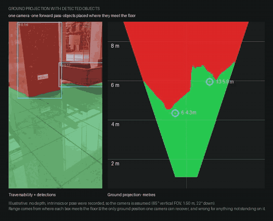
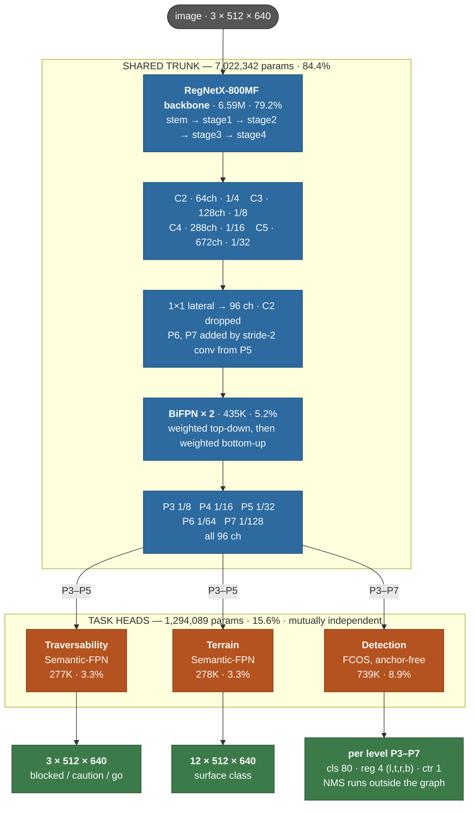

# SyncAI-Lib-HydraNet

Multi-head perception network for quadruped robots: **one forward pass, one frame, three
outputs — traversable surface, terrain class, object detection.**
The architecture follows the Tesla HydraNet idea: a shared backbone and neck carry almost
all of the compute, while the task heads stay tiny and mutually independent.



Left, traversability with detections: green is walkable, red is blocked. Right, the same
answer projected onto the floor in metres, each detected object placed where its box meets
the ground — the one range a single camera can recover. Handheld footage of a building
lobby, run through the 60-epoch multi-task checkpoint. The camera height and pitch there
are assumed, not measured; on the robot the ground plane is fitted to the depth return
each frame, which also tracks the pitch and roll of a walking quadruped.

**Read it for what it is.** The floor, the walls and the partitions are solid, and the two
heads agree with each other — the trunk is doing its job. What this clip cannot show is the
part that is not finished: `caution` scores 0.33 on the held-out test split and `stairs`
0.32, because three of the four terrain classes that map to `caution` have **zero** training
examples, and because the training data is ADE20K — human-height web photography, not
footage from a robot's camera. Point the same model at a ceiling and a quarter of it comes
back "go". The gap is data, not architecture; [docs/METHODOLOGY.md](docs/METHODOLOGY.md)
says what to collect and in what order.



Shapes above are for the default `input_size: [512, 640]`; the segmentation heads always
resize their logits back to the input resolution, so the two mask outputs match the image
whatever it is set to.

The parameter split bears the design out: **84.4% shared trunk, 15.6% for all three heads
combined** (8,316,434 total). A fourth head costs roughly 3–9% more parameters and reuses
the 84% already paid for.

- **Backbone**: torchvision RegNetX, swappable to ResNet18/34/50 with one config key
- **Neck**: BiFPN (fast-normalized fusion), with plain FPN as the alternative
- **Head 1, traversability**: Semantic-FPN style segmentation, 3 classes
- **Head 2, terrain**: the same segmentation head, 12 classes
- **Head 3, detection**: FCOS, anchor-free (focal + GIoU + centerness)
- **Multi-task balancing**: Kendall learned uncertainty weighting (or fixed weights)
- **Partial supervision across datasets**: each step draws a batch from a single dataset and
  backpropagates only the losses of the heads that dataset supervises
- **One annotation, two heads**: terrain labels generate traversability labels via a policy table
- **TensorRT friendly**: the forward graph is only Conv/BN/ReLU/Resize/MaxPool/Exp/Mul; NMS
  lives in post-processing

## Installation

The project uses [uv](https://docs.astral.sh/uv/) for environments and dependencies.

```bash
uv sync --group dev --extra export   # create .venv and install everything
uv run pytest                        # smoke tests, no dataset required
```

Training, evaluation and inference all pick CUDA → MPS → CPU automatically.

```bash
uv run hydranet-prepare-ade20k --src datasets/ADEChallengeData2016 --dst datasets/ADE20K \
    --test-fraction 0.5
uv run hydranet-train --config configs/hydranet_indoor.yaml
uv run hydranet-eval  --config configs/hydranet_indoor.yaml \
    --checkpoint runs/hydranet_indoor/best.pt --split test
```

## Where to look

| If you are | Read |
|---|---|
| running it | [docs/USAGE.md](docs/USAGE.md) — datasets, training flags, what a run leaves behind |
| new to multi-head training | [docs/TRAINING_GUIDE.md](docs/TRAINING_GUIDE.md) — why it is shaped this way, and which measurements lie |
| picking it up as a team | [docs/METHODOLOGY.md](docs/METHODOLOGY.md) — dividing the work, what data to collect, the four levels of evaluation |
| annotating | [docs/ANNOTATION_SETUP.md](docs/ANNOTATION_SETUP.md) — the CVAT stack and the labelling contract |
| changing the architecture | [docs/ARCHITECTURE_REVIEW.md](docs/ARCHITECTURE_REVIEW.md) — measured answers, including two that say *no* |
| deploying | [docs/DEPLOY_JETSON.md](docs/DEPLOY_JETSON.md), then [docs/ORIN_BRINGUP.md](docs/ORIN_BRINGUP.md) for a board from scratch |
| shipping a version | [docs/RELEASE.md](docs/RELEASE.md) — `dev → stage → main`, and separately how a *model* gets a version |
| scoping a retail robot | [docs/RETAIL_SCOPE.md](docs/RETAIL_SCOPE.md) — what to build and what to keep out of the network |
| turning a mask into metres | [docs/GROUND_PROJECTION.md](docs/GROUND_PROJECTION.md) — the projection above, and why the camera pose is fitted per frame |
| on a Mac | [docs/TRAIN_MACOS.md](docs/TRAIN_MACOS.md) |

`docs/journal/` holds dated notes from particular days — the newest is
[2026-08-14](docs/journal/2026-08-14-deploy-retail-handoff.md), which says what is in flight — a session handoff, a hardware
move. They are records, not documentation: they are accurate about the day they describe
and are not maintained afterwards.

## Commands

Installation provides these console scripts:

| Command | Purpose |
|---|---|
| `hydranet-train` | Training |
| `hydranet-eval` | Run validation on a checkpoint |
| `hydranet-infer-image` | Overlay inference on a single image or a folder |
| `hydranet-infer-video` | Video inference (uses the system ffmpeg, no opencv needed) |
| `hydranet-export-onnx` | Export ONNX for TensorRT |
| `hydranet-prepare-ade20k` | Filter ADE20K to its indoor subset and lay it out as `seg_folder` |
| `hydranet-report` | Summarise one run, or rank runs and diff their configs |
| `hydranet-annotation` | Emit the CVAT label schema; gate an annotated dataset before training on it |

Run them all with `uv run <command>`, or `source .venv/bin/activate` first.

## Deployment configs

| Config | Environment | Terrain classes | Segmentation datasets |
|---|---|---|---|
| `hydranet_regnet800mf.yaml` | Off-road | 12 outdoor (grass / gravel / tree-bush …) | RUGD, RELLIS-3D |
| `hydranet_indoor.yaml` | Indoor (lobbies / corridors / factory floors) | 12 indoor (floor / glass / stairs …) | ADE20K + your own annotations |
| `hydranet_retail.yaml` | Retail (shops / supermarkets) | the indoor 12 + `display_fixture` | ADE20K + store footage |

Model structure, losses and training mechanics are identical across all three — the
differences are `data.terrain_classes`, `label_map` and the data sources. All three use
COCO for the detection head, unchanged.

Each inherits `configs/_base/hydranet.yaml`, so a config file contains only what makes
that deployment different. What is *not* in a file comes from the base, and the run's
`meta.json` records the merged result.
Label schemes are defined in `SCHEMES` in
[`label_maps.py`](src/syncai_hydranet/data/label_maps.py); the indoor mapping is in
[`label_maps_indoor.py`](src/syncai_hydranet/data/label_maps_indoor.py).

If your camera's aspect ratio differs from `input_size`, turn on `data.letterbox: true`
(a portrait phone video squeezed straight into the input is compressed more than 2× horizontally).

## Adding a task head (example: monocular depth)

1. Add the head module under `src/syncai_hydranet/models/heads/` (it takes the FPN feature list)
2. Register the type branch in `hydranet.py::HydraNet.__init__` and add its loss in `compute_losses`
3. Add a `model.heads` section to the config, and list the new head under the relevant
   dataset's `supervises`

Heads are mutually independent, so this does not affect training or deployment of the
existing ones.

## Development

```bash
uv run ruff check --fix .    # lint + import sorting
uv run ruff format .         # formatting
uv run pytest --cov          # tests + coverage
uv run pre-commit install    # enable pre-commit checks
```

CI runs lint plus a Python 3.10 / 3.12 test matrix on GitHub Actions, and fails below 68%
coverage. The tests need no datasets: model tests run on random tensors, dataset tests build
a fixture in `tmp_path`, and `test_overfit.py` verifies the training loop really converges by
memorising one synthetic batch to over 95% pixel accuracy (chance is 33% across three classes).

## Project layout

```text
src/syncai_hydranet/
├── config.py                 # YAML config + dot-path overrides
├── config_schema.py          # config validation: unknown keys, types, cross-field consistency
├── cli/                      # console script entry points (train/eval/infer/export/report)
├── models/
│   ├── backbone.py           # RegNet / ResNet multi-scale features
│   ├── neck.py               # BiFPN / FPN
│   ├── heads/segmentation.py # Semantic-FPN segmentation head (shared by both seg heads)
│   ├── heads/detection.py    # FCOS head + target assignment + decode/NMS
│   ├── losses.py             # CE+Dice / Focal+GIoU / uncertainty weighting
│   └── hydranet.py           # assembly + compute_losses + predict
├── data/
│   ├── label_maps.py         # off-road mappings + the SCHEMES registry
│   ├── label_maps_indoor.py  # indoor 12 classes + ADE20K mapping
│   ├── datasets.py           # SegFolderDataset / CocoDetDataset / split resolution
│   ├── transforms.py         # joint image+mask+box augmentation, letterbox, geometry inversion
│   ├── fingerprint.py        # dataset fingerprints, written into meta.json
│   └── multitask.py          # round-robin loader across datasets
├── engine/
│   ├── trainer.py            # AMP / EMA / cosine / gradient accumulation / checkpoints / TB
│   └── evaluator.py          # mIoU + COCO mAP + primary metric selection
└── utils/
    ├── device.py             # CUDA → MPS → CPU
    ├── checkpoint.py         # safe loading (weights_only) + format version
    ├── runmeta.py            # git / environment / config snapshot / metrics.jsonl
    ├── seeding.py            # global seed, worker seeds, backend flags
    └── visualize.py          # palettes, overlays, letterbox, comparison images
```

## Licence

Apache-2.0 (ADE20K / RUGD / RELLIS-3D / COCO each carry their own data licences — check them
before commercial use).
