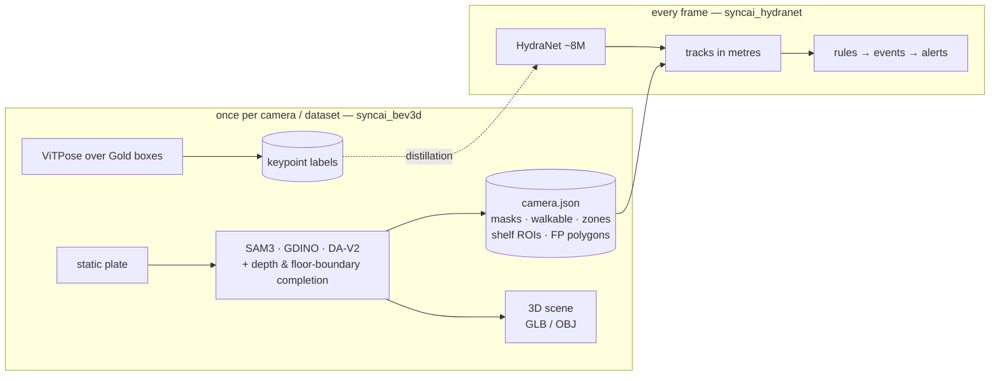

# SyncAI-Lib-HydraNet — security & retail analytics for fixed store CCTV

[](https://github.com/Syncrobotic/SyncAI-Lib-HydraNet/actions/workflows/ci.yml)
[](pyproject.toml)
[](https://pytorch.org/)
[](LICENSE)

One camera, one model, two readings: **loss prevention** (who entered where, what did they
do, did stock leave unpaid) and **retail analytics** (footfall, dwell, paths, queues) from
the fixed CCTV already on the ceiling. No LiDAR, no new hardware.


*Left: person boxes and confirmed tracks, with this camera's false-positive polygons
applied — **staff blue, everything else green**, one verdict per person from nine
torso-colour statistics. Two colours, not three: a track too short to have a verdict is
drawn as a customer, so a member of staff crossing in under about a second is green — the
cost of not putting a third colour on screen that a viewer has to be told how to read.
Right: the
same moment in metres, the store's own furniture reconstructed from one static plate, a
figure at every tracked shopper's floor position — wearing its verdict colour from its
first frame, because the verdict floor equals the tracker's confirmation delay. **The
amber floor tiles are the live dwell field**: occupancy-seconds accumulating as the clip
plays, clipped to the walkable polygon, scale-topped at its own p99 so one queue cannot
eat the ramp. Furniture and devices are fitted from the static plate using calibrated
projection, support surfaces and class dimension priors; no second sensor is involved.*

*Three things to read the panels with. **Every face is blurred by `demo_video.py` itself**,
by two instruments, and `demo_gif.py` then re-runs the detector on the source frames at a
far lower threshold and refuses to write the figure unless every person it finds falls
inside a blurred region — it has refused one (PLAN §7.24). **The right panel has fixtures,
not a room**: a fixed camera sees part of one store, so the walls are the runs that were
observed rather than a closed boundary, and wall heights and minimum column heights follow
stated conventions, printed on the panel, because depth is unreliable on white surfaces.
And **the window
is the busiest 24 seconds of a three-minute clip**, chosen automatically by
`demo_gif.py --start auto` — a figure of an empty shop shows nothing, but it is a selection
and this is it being said. The 120 sampled frames play in 12 seconds.*

*The colours are licensed per camera and refused where they are not earned. This camera
scores 1.00 held out on its own 15 labelled crops; the same model is refused on
Tao-Hsin-cam04, which scores 0.417. And it is not a model that paints everyone one colour:
pointed at Taichung-cam01, a repair counter, it calls **98.5% of person-observations
staff**, 2,144 against 34.*

**A second store**, the same code, and a camera whose colours had to be earned twice:


*Taichung-cam10 **is** coloured, and what it took is the point. It had 15 labelled crops,
all 15 staff and 0 customers, so a model held out on it scored a clean 1.000 that measured
only whether it calls staff staff — an accuracy that cannot be wrong about customers cannot
license colouring them, and the gate refused it (PLAN §7.23). It has 127 crops now — 47
staff, 65 customer, 6 unclear — and the model reads **0.874** held out on them. That is
below the derived 0.90 floor, so the exception is stated at the call site with
`--staff-min-accuracy 0.85`, printed on the figure, and recorded in its verdict: a figure
never carries a threshold nobody can see. **Metres remain estimates**: camera calibration
and class priors determine scale, and these figures have no new independent floor-distance
measurements. Better silhouette alignment does not establish absolute dimensions or
resolve every object's front/back orientation.*

Both figures were rebuilt on **2026-09-11** with the current Stage0 furniture and device
placement: cam04's round table and refined counter support, cam10's longer shelf and
individually fitted laptops and stools. Each figure's audit records the render hash,
scene source hashes (including uncommitted changes), input hashes and detector checkpoint:
[cam04 audit](assets/demo_Kaohsiung-cam04.audit.json),
[cam10 audit](assets/demo_Taichung-cam10.audit.json).

The whole plan — architecture, data strategy, build order, and the measurements behind
every decision — lives in **one document: [docs/PLAN.md](docs/PLAN.md)**. Everything the
project previously documented is in git history (`git show b7457c2:docs/<file>`).

## The design in one paragraph

Two packages with one contract between them. `syncai_bev3d` runs **once per camera**: it
builds a static plate, fits the ground geometry, runs the teachers one time, and emits a
`camera.json` — walkable floor, walls, columns, doors, display tables and shelves,
products down to `iphone / ipad / macbook / boxed_stock`, shelf ROIs, and the derived
false-positive polygons. The same artefacts render a metric 3D scene per camera, exported
as `scene.glb` / `scene.obj`. `syncai_hydranet` runs **every frame**: a shared
RegNetX-800MF + BiFPN trunk carrying **the three heads this product trains** — detection
(`person`, `bag`, `device`, `boxed_stock`), pose (17 keypoint heatmaps at P3, decoded
inside the detection boxes), and terrain segmentation (`floor`, `wall`, `column`,
`fixture`, `person`) — whose boxes become tracks *in metres* through the cached geometry.
`models/hydranet.py` defines a fourth family, monocular depth, and each config trains the
subset it names; the retail-security configs do not name depth. **Terrain is not a
leftover**: it is what the commissioning pass reads to find the floor, the walls and the
fixtures, so `terrain_mIoU/site_seg03` is the metric a checkpoint for this product is
chosen on as much as its detection mAP is. Everything above that
is rules, a tiny temporal model, and a VLM on trigger.

**Anything constant on a fixed camera is cached, never learned; only what changes
frame-to-frame spends the GPU.** The boundary is enforced rather than remembered:
`tests/test_package_boundaries.py` fails if a serving-path module ever imports
`syncai_bev3d`.

## Two model suites, one product

The project runs **two very different kinds of model**, and confusing them is the
classic failure this architecture exists to prevent:

| | the **teachers** (`syncai_bev3d`) | the **student** (`syncai_hydranet`) |
|---|---|---|
| models | SAM 3, Grounding DINO, Depth-Anything V2, ViTPose — hundreds of millions to billions of parameters | one HydraNet, **~8 M parameters** |
| when | **once per camera** (commissioning) and **once per dataset** (labelling) | **every frame, 96 streams × 5 fps** |
| where the answers go | cached: `camera.json`, masks, keypoint files | inferred: boxes + keypoints per frame |
| allowed to be slow | yes — 40 s per plate is fine | no — the whole budget is 480 frames/s (PLAN §7.4) |



## Install & run

```bash
uv sync                                        # or: pip install -e .
hydranet-train --config configs/<config>.yaml  # train
hydranet-eval --config configs/<config>.yaml   # evaluate
hydranet-infer-video ...                       # overlay inference on a clip
hydranet-export-onnx ...                       # ONNX for the TensorRT path
```

Entry points: `hydranet-train`, `hydranet-eval`, `hydranet-infer-image`,
`hydranet-infer-video`, `hydranet-scene`, `hydranet-export-onnx`, `hydranet-annotation`,
`hydranet-report`, and the two dataset preparers `hydranet-prepare-ade20k` and
`hydranet-prepare-cocostuff` — ten, which is what `[project.scripts]` in `pyproject.toml`
declares.

Those are the *training and export* surface. Running the product over a store is the
three stages below, and none of it goes through those entry points.

## Running it over a store — the three stages

**Read this first, because the shape of the system is not what the diagram suggests.**
There is no service. [`deploy/`](deploy/) states it: the one deployment surface is
`not assembled — README only, no runtime here yet`. `scripts/serve_pilot.py` runs L0 plus
a tracker and emits **no positions, no events and no alert rows** (PLAN §9.6). What runs
the whole chain today is an **offline batch** over stored clips. Stage 1 below is a
scheduled batch job, not a daemon, and saying otherwise is the failure this repository
has the most notes about.

### Stage 0 — once per camera (commissioning)

Turns one camera into a metric coordinate system, a set of zones, and a structure map,
all cached. Every later stage reads the result for free.

```bash
# 0-1  footage: wide across cameras, thin within each one (the bucket is ~3 TB)
python3 scripts/pull_studioa.py --date 2026-08-16 --times 11:30 16:00 --out datasets/studioa_clips
# 0-2  the empty store: a temporal median removes every moving person by construction
python3 scripts/static_plates.py --root datasets/studioa_clips --out datasets/studioa_static
# 0-3  geometry: undistort -> DA-V2 once -> RANSAC ground plane -> person-height scale
nice -n 10 .venv/bin/python scripts/onboard_camera.py --camera <camera> --out runs/onboard01
# 0-4  calib.json -> a camera.json review bundle and raw-frame 1 m grids
uv run python tools/commissioning/commission_camera.py runs/onboard01/<camera>.calib.json \
    --out runs/commission_review/<camera>
# For a new camera, install the reviewed geometry before the structure passes:
cp runs/commission_review/<camera>/<camera>.camera.json runs/commission01/<camera>.camera.json
# 0-5  structure, then what the vote was too conservative to claim
uv run python tools/commissioning/masks_pass.py <camera> --plates-root datasets/studioa_static --out-root runs/commission01
uv run python tools/commissioning/extras_pass.py <camera>       # doors, products, individual scene assets
uv run python tools/commissioning/depth_complete.py <camera>    # zero GPU, reads the caches
# 0-6  zones: proposed automatically, then accepted or rejected by a person
uv run python tools/commissioning/service_zones.py --all --apply
uv run python tools/commissioning/zones_confirm.py <camera> --render --apply
# 0-7  known-false-positive polygons: derived from the box population, never drawn
uv run python tools/commissioning/fp_polygons.py <camera>
# 0-8  look at what was built
uv run python tools/commissioning/scene_overlay.py <camera>     # do the metres agree with the pixels
uv run python tools/commissioning/scene_mesh.py <camera>        # solid 3D, GLB/OBJ
```

Produces `runs/commission01/<camera>.camera.json` (pose, lens, walkable polygon, zones,
shelf ROIs, FP polygons), `<camera>/masks/`, `<camera>/scene.{glb,obj}`, and a verdict
line in `REVIEW.md`.

Stage0 now preserves individual laptop, monitor, chair, stool, tablet and phone masks.
For an already commissioned camera, refresh just these objects with
`uv run python tools/commissioning/objects_pass.py <camera>` (add `--device cpu` if needed),
then rerun `tools/commissioning/scene_mesh.py <camera>`. The normal extras pass includes
this step. Scene building reads `masks/object_instances.npz` and rejects masks from a
different source plate. It fits each asset's continuous rotation and bounded dimensions
against the raw-lens silhouette on a reconstructed tabletop, shelf or the floor;
flat/standing devices and pedestal/four-leg stools are compared as separate templates.
Support checks use rotated/round fixture polygons and reject floating or intersecting
objects. Detected device categories replace the old region-filling schematic arrays.

`scene.objects.json` records every accepted/rejected object, dimensions in metres,
heading, support height, silhouette IoU and front/back ambiguity. Dimensions inherit the
camera's scale and category priors; silhouette alignment alone does not establish a
surveyed size or reliably identify the front of a symmetric object. Unseen/occluded
objects can remain absent. Computer-tower auto-detection is disabled after the local
plate review found packaged goods misclassified as towers. Door frames use the fitted
opening plane; handedness and opening angle are not inferred from a doorway mask.

When the source clearly shows a display or rear casing, record that visual review with
`uv run python tools/commissioning/facing_review.py <camera> --instance <id>
--visible-side front --reviewer <name> --evidence <description>` (use `back` for a rear
casing), then rebuild the scene. Reviews in `masks/object_facing.json` are bound to the
source image and instance mask; changed evidence invalidates them. A reviewed 180-degree
flip preserves position and dimensions and must retain silhouette IoU at least 0.42,
losing at most 0.05. Edge-on views remain unresolved. This is a reviewed observation,
not automatic screen recognition. Reports distinguish `axis_only` templates, whose
front/back is not represented, from directed assets; `heading_requires_review` and
`front_back_status` retain that distinction.

The object pass also writes `masks/support_tops.npz`. Scene building can use the visible
tabletop boundary and cabinet body together to refine a rectangular table's footprint
and heading, while preserving round tables and already aligned tops. A cropped body
cannot change the support height. Refinements must pass checks against neighboring
fixtures and existing high-confidence devices; `scene.supports.json` records both gains
and tradeoffs in top/body alignment. Refresh only these masks with
`tools/commissioning/objects_pass.py <camera> --supports-only`.

For independent scale validation, `tools/commissioning/measure_floor.py <camera>
--out runs/scale_measurements/<camera>` creates an offline image picker. Enter **actual
measured floor distances**, with at least two fitting segments and one separate validation
segment in another direction. Its downloaded JSON can be passed to
`tools/commissioning/commission_camera.py ... --distance-controls measurements.json --out ...`.
This fits metric scale without requiring a room coordinate origin; it keeps intrinsics
and camera angles fixed and transfers zones to preserve their image positions. A failed
validation exits with status 2. Outputs remain a separate review bundle; geometry caches,
upstream calibration scale and scenes must be updated consistently before installing it.
Assumed tile sizes and device dimensions are not independent metric validation.

The review bundle contains `grid.before.png`, `grid.after.png`, the candidate
`<camera>.camera.json`, and `geometry-review.json`. It refuses an existing output
directory. Use `--existing runs/commission01/<camera>.camera.json` when updating a
commissioned camera so its zones, masks and ROIs are retained. A conversion without
surveyed controls is explicitly **UNVERIFIED for absolute metric accuracy**.

**Nine selling-floor cameras now have commissioned files** (Gate D, PLAN §10.4b).
Most field of view values still inherit the fleet assumption, and scale comes from
person-height or automatic ruler estimates; these are not tape-measure ground truth.
The grid shows the camera's geometry, including lens distortion, rather than certifying
that its metres are correct.

Optional independent metric calibration:

```bash
uv run python tools/commissioning/commission_camera.py runs/onboard01/<camera>.calib.json \
    --existing runs/commission01/<camera>.camera.json \
    --controls <survey-controls.json> --fit-focal --out runs/commission_review/<camera>-survey
```

The control format and acceptance rules are in **[PLAN §10.9](docs/PLAN.md#109-stage-0-precision-and-cache-consistency)**.
This optional survey path complements automatic commissioning; it does not turn the
person, tile or table priors into independent measurements.

**After changing geometry, rebuild depth geometry before the scene.** Consumers now
refuse stale caches. This command runs DA-V2 once and reuses existing masks:

```bash
uv run python tools/commissioning/rebuild_geometry.py runs/commission01/<camera>.camera.json \
    --calib runs/onboard01/<camera>.calib.json --out runs/commission_review/<camera>.geometry.npz
```

`--calib` verifies that the onboard calibration matches the camera before inheriting its
depth scale. After survey refinement, use `--floor-mask <raw-walkable-mask.png>` instead
to align depth to the corrected floor; its residuals measure consistency with that floor,
not independent object-height accuracy. `--depth <plate.depth.npy>` reuses a previous
unscaled DA-V2 pass on the same undistorted plate. Install the reviewed cache at
`runs/site30k_qa/geometry_cache/<camera>.npz`, then rerun the scene export. The initial
missing converter CLI and grid renderer are both restored by this workflow.

### Stage 1 — continuous analysis

```bash
python3 scripts/step6_events.py --camera all --all-clips \
    --loiter-seconds 240 --max-occupancy 4 --min-seconds 1.0 --out runs/step6_fleet02
```

Reads a commissioned `camera.json`, tracks the clip, rescales the boxes into the
calibrated frame, applies the event rules in metres and seconds, and files **every** event
through `dispositions.record_alert`. `runs/step6_fleet01` is the reference run: 8 cameras
× 162 minutes, 47 minutes of GPU, **263 alert rows**.

**The threshold is the product, not the model.** The same 162 minutes, re-read:

| `--loiter-seconds` | alerts per camera-day |
|---|---|
| 8 (the demonstration value) | 1,478 |
| 30 | 427 |
| 120 | 30 |
| **240** (the archetype §5 itself uses) | **6** |

Same geometry, same weights. Security wants the 6 and pays recall for it; retail wants the
1,478 because it aggregates (PLAN §1.1). Get the store's own rules before touching a model.

Output is `fleet.json` (per-camera counts) and `dispositions/YYYY-MM-DD.jsonl`, which is
the file that matters: append-only, one row per alert and one per verdict joined by
`alert_id`, each carrying `basis`/`value`/`threshold`, the checkpoint and commit that
raised it, the calibration hash, and a `frame_ref` — **a pointer to footage, never an
image**, which is what lets the 30-day clip tier expire without touching the log (§4.6).
A row with no `frame_ref` is refused at write time.

Scheduling this is a systemd user unit. Making it *live* is three separate things, and
only the last is research: the serving path does not reach the event layer; `data/video.py`
decodes 63–69 streams where NVDEC reaches ~520 and is not wired in; and there is no
service shell. The engine is not the constraint — 990 f/s end to end against a 480 f/s
target (§7a.29). **Decode is.**

### Stage 2 — reports, and the algorithms above them

```bash
uv run python tools/commissioning/heatmap3d.py <camera> --mode dwell --cell 0.25
uv run python tools/commissioning/demo_video.py <camera>      # 3 min, faces blurred by two instruments
python3 scripts/retail_flow.py --out runs/flow02 --cell 0.25 <clips...>
python3 scripts/site_journeys.py --cameras <camera> --min-seconds 1.0 --out runs/journeys01
```

To rebuild the two README figures from the current Stage0 inputs:

```bash
uv run python tools/commissioning/demo_video.py Kaohsiung-cam04 --frames 900 --fps 5 --staff-colours runs/staff_model01/model_Kaohsiung-cam04.json
uv run python tools/commissioning/demo_gif.py Kaohsiung-cam04 --start auto
uv run python tools/commissioning/demo_video.py Taichung-cam10 --frames 900 --fps 5 --staff-colours runs/staff_model01/model_Taichung-cam10.json --staff-min-accuracy 0.85
uv run python tools/commissioning/demo_gif.py Taichung-cam10 --start auto
```

The renderer rebuilds geometry and saves a `.render.json` beside each stamped MP4.
The GIF tool checks its render and input identities before auditing source frames;
inspect all generated contact sheets in `runs/commission01/<camera>.gif_check/` as well.
If the camera, masks, plate or detector changes, re-render before cutting the GIF.

`hydranet-report` is **not** one of these — it summarises training runs. And this hardware
does not do footfall: an angled view merges two shoppers walking abreast, which is
geometry rather than an algorithm, so `retail_flow.py` ships dwell and heatmaps and says
so in its own header.

Anything that leaves the building goes through `analytics.delivery.report_settings()`,
which reduces every path-shaped value in the settings block to its last two components —
`vars(args)` otherwise names an operator, a home directory and a dataset root in a file
that looks like output.

**Before adding an algorithm here, PLAN §3's rule applies**: walk down from "a config
value" and stop at the first rung that answers the question — never start at a new head.
And §9.2 bounds every number this stage can produce: nothing on site has been graded, so
`site_person` 0.7387 means *agrees with Grounding DINO*, and 263 alert rows are not 263
labels. The shortest path to the first real signal is one commissioned camera at
`--loiter-seconds 240`, then a person reading the handful of rows against their video.

## Layout

| path | what |
|---|---|
| `src/syncai_bev3d/` | commissioning: calibration fitting, plate pipeline, SAM 3 / Grounding DINO teachers, BEV & scene rendering — runs once per camera |
| `src/syncai_hydranet/` | the per-frame side: models, training engine, data, runtime geometry + the `camera.json` contract, serving, analytics |
| `configs/` | training configs — `config.yaml` inside a run directory is the only authoritative record of what a run trained on |
| `docs/PLAN.md` | the plan; the single source of truth |
| `tools/commissioning/` | the per-camera pipeline: metre-grid verification, structure masks, depth completion, product subclasses, false-positive polygons, and the 3D scene renders (`scene_mesh.py` → GLB/OBJ). `masks_diagnose.py` and `cluster_rules.py` are its instruments: the first keeps the per-cluster verdict the pipeline otherwise prints as a total, the second replays those cached proposals through a different rule with no GPU |
| `tools/pose/` | the ViTPose teacher run that labels the Gold boxes for the pose head |
| `tools/site30k/`, `scripts/` | campaign tooling, static plates, teachers' CLI front ends, and the measurement instruments a claim in this file rests on — `track_review.py` (turn track ground truth into minutes of judgement), `track_idf1.py` (both trackers over one inference pass), `zone_dwell.py` (does a visit survive the tracker) |
| `datasets/`, `runs/`, `exports/`, `weights/` | data and artefacts (largely gitignored) |

## Credits

**Teachers.** The commissioning pass runs four published models once per camera and caches
their answers; none of them is in the serving path. Each is pinned to an exact commit in
`src/syncai_bev3d/teachers/` and `tools/pose/`.

| model | used for |
|---|---|
| [SAM 3](https://huggingface.co/facebook/sam3) (Meta) | promptable segmentation of the static plate — fixtures, floor, products |
| [Grounding DINO](https://huggingface.co/IDEA-Research/grounding-dino-base) (IDEA Research) | open-vocabulary boxes, and the `person` proposals the student is distilled from |
| [Depth-Anything V2 Metric Indoor](https://huggingface.co/depth-anything/Depth-Anything-V2-Metric-Indoor-Large-hf) | fixture heights where the depth holds |
| [ViTPose](https://huggingface.co/usyd-community/vitpose-base-simple) (USyd) | the 17-keypoint labels the pose head is trained against |

**Datasets.** Public sets used for pre-training, mixing and evaluation:
[ADE20K](https://groups.csail.mit.edu/vision/datasets/ADE20K/) ·
[COCO](https://cocodataset.org/) and
[COCO-Stuff](https://github.com/nightrome/cocostuff) ·
[HM3D](https://aihabitat.org/datasets/hm3d/) ·
[NYU Depth v2](https://cs.nyu.edu/~silberman/datasets/nyu_depth_v2.html) ·
[RAP v2](https://www.rapdataset.com/) ·
[PA-100K](https://github.com/xh-liu/HydraPlus-Net) ·
[PETA](http://mmlab.ie.cuhk.edu.hk/projects/PETA.html) ·
[Market-1501](https://zheng-lab.cecs.anu.edu.au/Project/project_reid.html) ·
[PoseLift](https://github.com/TeCSAR-UNCC/PoseLift). Each keeps its own licence and terms;
this repository redistributes none of them.

**Store footage.** Every frame of a shop in this repository comes from the deployment
partner's own cameras, is used with their permission, and has every face blurred by
`demo_video.py` before the file exists — see the figure caption above. Raw clips and plates
are gitignored and are not redistributed.

## Licence

Apache-2.0. See [LICENSE](LICENSE) and [CITATION.cff](CITATION.cff).
