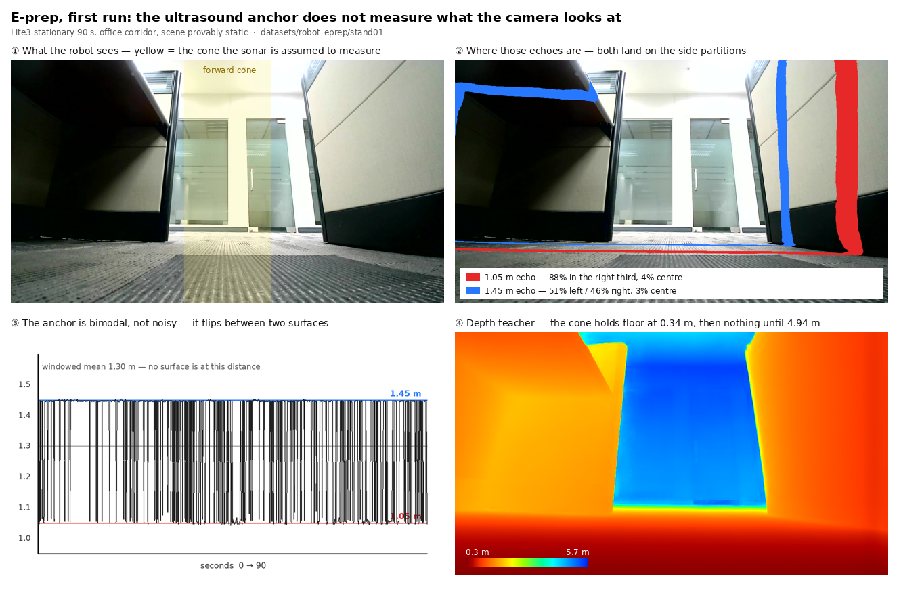

# Research direction: a BEV occupancy network for the quadruped, and the one thing it turns on

**Scope.** Product A, the Lite3 robot line ([`deploy/robot/`](../deploy/robot/)). The
north star is the modern occupancy-network perception stack — multi-camera → shared
backbone → geometry-conditioned BEV cross-attention → temporal transformer → a fan of
dense heads — adapted for a legged robot. This document does not argue the architecture;
it is the state of the art and it is settled. It argues about the **one prerequisite that
decides whether we can build it at all**, and lays out the research program around that.

## The target

```
each camera → shared backbone (RegNetX, already ours)
            → BEV cross-attention (learned projection conditioned on intrinsics/extrinsics;
                                   LiDAR point features injected when present)
            → temporal transformer (aggregate past N frames, ego-motion compensated)
            → heads:
                ① Occupancy (3D)
                ② Occupancy flow (dynamic/static + velocity)   ← the moving-obstacle answer
                ③ Semantics (person / vehicle / door / glass / …)
                ④ Traversability (legged: grass, gravel, stair walkability)
                ⑤ Ground height (elevation map for foothold planning)
```

Heads ④ and ⑤ are the legged-specific ones and they are the reason this is not just a
car's occupancy net; a body-level free-space map is not a foothold plan.

## The thesis: the research is supervision, not architecture

The transformer is a solved shape. What we do not have is **3D ground truth on a monocular
robot**, and ①②⑤ cannot be trained without it. So the whole program reduces to one
question: *can we label occupancy, flow and height without a 3D sensor?* Everything else
is engineering that follows once that answer is yes.

Three weak supervisors were wired up in the same week this document was written, and they
are exactly the anchors that make the answer plausible:

- **odometry** — `pos_world` / `vel_world` / `vel_body`, from the `0x0901` state packet
  (see the handoff journal). Legged-inertial pose we do not have to build.
- **ultrasound ×2** — `ultrasound[2]` in the same packet. **Measured, and it is weaker
  than it looks: see "E-prep, run once" below.** The spec defines it as
  `{forward_distance, backward_distance}` — forward and *backward*, not forward and down —
  so only one of the two has a camera pointed at it, and that one turns out not to measure
  what the camera looks at.
- **HydraNet's own heads** — `terrain` and `detection` already produce ③④'s labels.

## The auto-labeling pipeline (the crux)

Turn "no 3D sensor" into "no hand-drawn 3D labels":

```
robot video + odometry + ultrasound[2] + HydraNet semantics
  ├─ (A) monocular-depth teacher (Depth-Anything V2, offline)  → per-frame relative depth
  ├─ (B) temporal SfM / multi-view, odometry as the pose prior → metric geometry + scale
  ├─ (C) odometry displacement (ultrasound only where a beam    → SETS (A)'s metric
  │       model explains the echo — measured, see E-prep below)    scale; measured 15% out
  └─ (D) HydraNet terrain / detection                          → semantic labels for ①③④
        ↓ offline fusion
   pseudo-3D labels: occupancy voxels / ground-height / dynamic-static flow
        ↓
   train a full-size model (server / Orin) → distill to a small student (RK3588)
```

The teacher runs **once, offline, on the server** — never on the robot. The robot ever
only runs a distilled student. That is the Tesla/Wayve pattern and it is what keeps a
6-TOPS NPU in the conversation at all.

## Model evolution: grow HydraNet, do not rebuild it

One head at a time, each with a stop condition. The RegNetX backbone stays; the
`models/heads/registry.py` abstraction was built (its own docstring says so) for exactly
this — "a third head family: depth, keypoints, whatever comes."

| step | add | supervision | success gate |
|---|---|---|---|
| E1 | BEV lift (geometric projection first, then learned cross-attn) | geometry (`geometry/bev.py`, ours) | BEV-space seg mIoU ≥ the current 2D-then-project baseline |
| E2 | **⑤ ground-height head** | (A)+(B)+(C) pseudo-depth | height MAE vs held-out ultrasound / SfM |
| E3 | **① occupancy head** | pseudo-depth, voxelized | occupancy IoU vs SfM reconstruction |
| E4 | temporal transformer + **② flow** | odometry ego-motion + photometric consistency | dynamic/static F1; static-scene stability |
| E5 | **④ material traversability** (grass/gravel/stair) | collect + annotate ([METHODOLOGY.md](METHODOLOGY.md) ranks it) | per-class IoU; lift `stairs` off 0.32 |
| E6 | distill → RK3588 student | the full model as teacher | student ≥ 10 fps with metrics retained |

## First milestone — E-prep, and it is a decision gate not a demo

Before any head, answer the biggest unknown with a number: **is the monocular-depth
teacher good enough on this camera to bootstrap the labels?**

- Run Depth-Anything V2 over existing robot video (offline; RKNN not required for the
  teacher). Calibrate its relative depth against the two ultrasound returns and odometry
  `z`, and measure the residual.
- **Hypothesis:** teacher depth + our weak anchors give a metric residual below some
  threshold the campaign sets.
- **If it holds:** the auto-labeling floor is solid; E2/E3 have labels to train on.
- **If it does not:** this is the quantified case for buying a depth sensor
  (RealSense D435i / Orbbec / the Lite3 LiDAR variant). A number, not a hunch — and the
  same sensor then supervises ①②⑤ directly and closes the stairs/glass safety gap.

E-prep touches no hardware and buys nothing. It does not consume footage we already
have — there was none, see below.

## E-prep, run once — what came back (2026-08-18)

Run with [`scripts/robot_capture.py`](../scripts/robot_capture.py) +
[`scripts/eprep_depth_residual.py`](../scripts/eprep_depth_residual.py) on
`datasets/robot_eprep/stand01`: the robot standing still for 90 s in an office corridor,
scene provably static across the whole clip. **It did not produce a residual, and the
reason is worth more than the residual would have been.**



**There was no robot footage.** Every video in this repo is a fixed store camera, product
B. The quadruped had never recorded anything, so E-prep's "footage we already have" did
not exist; `robot_capture.py` is what makes it exist, pulling the live HLS stream and the
dashboard telemetry into one directory. Any future campaign starts there.

**The sonar is precise and bimodal, and its mean is a fiction.** With the robot stationary
and nothing in the scene moving, `forward_distance` flips between 1.05 m and 1.45 m several
times a second, each cluster tight to ±0.02 m. The sensor is not noisy — it is switching
which surface it locks onto. Anyone who smooths it over a window gets 1.30 m, a distance at
which this scene contains nothing at all, and calibrates the teacher to a surface that does
not exist. **Cluster the readings; never average them.**

**The echo is lateral, so the anchor and the teacher measure different things.** Projecting
both shells into the metric depth map, across 29 scored frames: 88% of the 1.05 m pixels sit
in the right-hand third of the image and 4% centrally; the 1.45 m pixels split 51/46 left and
right. They are the corridor partitions, caught by a wide sonar beam. Meanwhile the forward
cone holds the floor at 0.34 m (sd 0.005 m) and then nothing until the glass doors at 4.94 m.
**0 of 29 frames were comparable.** Fitting a forward depth to a lateral range is not a scale
error to be corrected; it is the wrong quantity.

**So E-prep is blocked, not answered — and the block is structural.** The gate ("is the
teacher good enough?") cannot be decided against this sensor without a sonar↔camera extrinsic
and a beam model that nobody has measured and the comm spec does not document. Two ways
forward, and the second is better:

1. Calibrate the sonar: measure its mounting and beam width, then only score frames whose
   echo the beam actually explains. Costs a calibration rig and still leaves one scalar per
   frame from a beam that prefers walls.
2. **Anchor on odometry under motion instead.** Drive the robot at a wall and require the
   teacher's distance to shrink by exactly the odometry displacement. This needs no
   extrinsic — it tests scale directly, over the full depth range, on every pixel that
   tracks. It is the measurement E-prep actually wanted.

**Which makes E-prep depend on the teleop thread, and that ordering was not visible before.**
Option 2 needs the robot to walk, and `pos_world` read exactly `(0,0,0)` for all 899 samples
of the standing capture — expected while stationary, but it means legged odometry is
*unverified*, and it is the supervisor this document leans on hardest. **Walk the robot
first** (teleop, in a clear area, hardware e-stop in hand), confirm `pos_world` integrates,
and capture the drive-at-a-wall clip in the same session. E-prep's number comes out of that
capture, not out of another standing one.

**Depth-Anything V2 Metric Indoor** turned out to be already cached locally and to return
*metres*, not the relative depth this document assumed. That looked like step (C) getting
easier — supplying scale demoted to checking it. Measuring it says otherwise; see below.

## The teacher's error bar, from public ground truth (2026-08-18)

Since the robot could not supply the anchor, [`scripts/eprep_teacher_nyuv2.py`](../scripts/eprep_teacher_nyuv2.py)
scored the teacher on **NYU Depth V2's 654-image official test split** — dense metric Kinect
depth, standard Eigen crop, no robot involved. This checkpoint is the Hypersim-trained one, so
NYUv2 is a *zero-shot* indoor domain for it, exactly as our corridor will be.

| | as-is (metric) | after one global scale |
|---|---|---|
| AbsRel | 0.212 | 0.101 |
| δ1 | 0.687 | 0.919 |
| MAE | 0.55 m | 0.27 m |
| median error | **+0.42 m** | 0.00 m |

**The "Metric" in the model name does not survive a domain change.** A single factor of
**0.847** — a flat 15% over-prediction — accounts for most of the error, and removing it
lifts δ1 from 0.687 to 0.919.

> **Second data point, 2026-08-19, and it is worse the further the viewpoint travels.**
> `runs/calib01` ran the same checkpoint on **ceiling-CCTV** plates and recovered 3.84 m
> against a 2.38 m fitted anchor — a **1.61× overestimate**, against NYUv2's 1.18×. Two
> zero-shot domains, and the error grows with distance from the training distribution
> rather than staying a constant. **This does not change the plan below; it hardens step
> (A)'s caveat**: a fleet-constant correction factor is plausible and unproven, so the
> teacher supplies *shape* and something else supplies the metre. See
> [journal/2026-08-19-security-retail-teachers-and-methodology.md](journal/2026-08-19-security-retail-teachers-and-methodology.md)
> §3 — and note the finding transfers in the useful direction: **orientation is
> recoverable** from one plate and one inference (pitch to −0.7°, and it caught a −12.9°
> mounting roll nobody knew about), which is exactly what (B)'s pose prior needs. The geometry is sound; the metres are not. **So step (C) is
back to *supplying* scale, not checking it**, and the earlier note in this document saying
otherwise was wrong. An auto-labeller that trusts the teacher's absolute output builds every
voxel 15% too far away.

**It is worst exactly where a legged robot lives.** Accuracy falls off as things get closer,
which is the opposite of what the use case needs:

| GT band | share of pixels | δ1 as-is | δ1 scaled | AbsRel scaled |
|---|---|---|---|---|
| 0–1 m | 3.0% | 0.429 | 0.820 | 0.163 |
| 1–2 m | 28.9% | 0.576 | 0.907 | 0.111 |
| 2–4 m | 53.9% | 0.757 | 0.936 | 0.090 |
| 4–10 m | 14.1% | 0.707 | 0.897 | 0.112 |

And the near field cannot be measured here at all: Kinect returns start near 0.7 m, while the
robot's forward cone put floor at **0.34 m**. The band that decides foothold planning is below
this dataset's floor, so public data can bound the teacher but cannot clear it.

**What this does to the gate.** Even granting perfect scale, 10% AbsRel is ~20 cm of error at
2 m. That is tolerable for coarse occupancy ① and not tolerable for ⑤'s elevation map, where
20 cm is the difference between a step and a wall. The depth-sensor question is therefore
*more* live after this measurement, not less — and the remaining unknown is narrow and
specific: **how the teacher behaves below 0.7 m on our own lens**, which only the robot can
answer, and only once it walks.

## Preconditions carried in from the platform work (do not rediscover these)

- **Per-frame ground plane, never a fixed pose.** A walking camera pitches *and rolls*
  every step; roll error rotates the floor and puts obstacles on the wrong side. The BEV
  now builds `GroundPlane` per frame from live attitude; `geometry/fit_ground_plane`
  (written, tested, unused) is the drop-in the day depth lands. See
  [GROUND_PROJECTION.md](GROUND_PROJECTION.md).
- **Traversability's `caution`/`stairs` are near-untrained** (0.33 / 0.32; three of four
  caution classes have zero examples). ~A quarter of a ceiling comes back `go`. Avoidance
  cannot key on ④ until those classes have data — a data precondition, not a planner one.
- **Fork: who owns locomotion.** The factory `jy_exe` has an official *autonomous mode*
  (`0x21010C03`) that follows velocity from a perception host, so body-level autonomy needs
  no policy replacement. ⑤'s foothold plan does — it requires a locomotion policy that
  *consumes* an elevation map (e.g. `Lite3_rl_deploy`), which the velocity interface does
  not expose. Decide this before ⑤, because it changes the data campaign.
- **Two compute tiers, one training pipeline.** RK3588 for the robot student, Orin for the
  retail/security tier ([DEPLOY_JETSON.md](DEPLOY_JETSON.md)). The auto-labeler and the
  full model are shared; only the distilled student differs. This is the same one-core /
  two-products split the repo is organised around.

## Why this unifies the two products

A patrolling quadruped running this stack is a **mobile instance of product B**: the same
person/detection/terrain perception and the same L1/L2 events ([RETAIL_SECURITY.md](RETAIL_SECURITY.md)),
now covering the aisles a fixed camera cannot see. The occupancy net is where product A's
navigation and product B's analytics stop being two problems.
