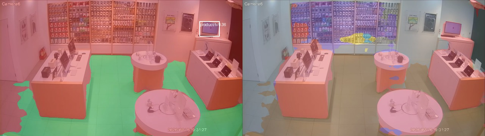

# Retail data: the splits, the teachers, and what may be believed off them

The companion to [RETAIL.md](RETAIL.md). That file says what the model outputs; this one
says where the labels come from, which numbers are measurements and which are agreements
between two machines, and the rules that keep the difference visible.

Merged 2026-08-19 from `RETAIL_OBJECTS_SPLIT.md` and `PERSON_ATTRIBUTES.md`, plus the data
findings that were living inside the scope and security documents.

**The one sentence to carry out of it:** *every site number this project can currently
produce is an agreement with a teacher model, not an accuracy* — and the rules below exist
because a number and a well-evidenced number are formatted identically.

---

## 1. Why this file exists, in one measurement

This file exists because of one measurement. The 60-epoch run
`runs/hydranet_retail_objects` scored **terrain_mIoU 0.7668** and, on daytime site
footage from the stores it is meant to serve, predicted **`column` 0.00% and `product`
0.00%** — the two classes the taxonomy was created for. Both numbers are true at the same
time and neither is wrong. The first is ADE20K, the second is the shop.

So the split below is not a tidiness exercise. It is the instrument that would have caught
that, and the rules are written down because most of them are only enforceable by someone
choosing to honour them later.

---

## 2. The split rules

**R1 — Split by camera, never by frame.** These are fixed cameras. Two frames from one
clip are the same shelf, the same floor tiles and the same pixels, a second apart. A
frame-level split puts the answer in the training set and the test set measures memory.
This is the only rule here whose violation invalidates every number that follows it.

**R2 — A test camera never supplies a training frame. Ever.** Not in batch01, not in
batch02, not "just the night clips from it". The moment it does, every comparison across
batches needs a footnote explaining which model saw what, and in practice nobody writes
that footnote. Enforced structurally: test cameras live under the `test` split, and
`configs/*.yaml` names `split_train` separately.

**R3 — Test masks are human-corrected. A pre-label is disqualifying.** The training data is
SAM 3's opinion. If the test data is also SAM 3's opinion, the metric reports whether the
model reproduced SAM 3, not whether it is right — a record produced by the thing it is
being used to check. That is the failure the session board of 2026-08-17 spent a day
naming, and it is not less circular for being about pixels.

> **R3 IS CURRENTLY UNSATISFIED, and this is the honest record of it.** A human pass on
> batch02's 72 test frames was attempted on 2026-08-17 and not completed — correcting dense
> retail masks with a brush is expensive, which is a fact about the task and not a failure
> of will. What is on disk is SAM 3's pre-label plus one automated device-recovery pass;
> 0.49% of test pixels differ from the raw pre-label and every one of those differences is
> machine-made. `datasets/retail_objects_batch02/split.json` carries the same statement
> under `test_provenance`, so it travels with the data rather than living only here.
>
> **Therefore every site number this project can currently produce is an *agreement* with
> SAM 3, not an accuracy**, and it shares SAM 3's systematic errors with any model trained
> on batch02 — the two cancel exactly where both are wrong. Quote such numbers with the
> word "agreement" attached, or not at all.
>
> **A cheaper path than full correction, for whoever picks this up.** Redrawing every mask
> is the expensive version of the question. The cheap version is *judging* rather than
> drawing: present each connected component of a class and take keep / drop / relabel.
> That is clicks instead of brushwork, it bounds precision honestly, and it is enough to
> say whether SAM 3's `fixture` boundaries and over-wide `column` masks — the two the
> consistency measurement flags as least stable — are trustworthy. It does not measure
> recall, and a split corrected that way must say so.

**R4 — Every rare class appears on at least two test cameras.** One fixed camera is one
scene measured N times, not N samples. A `column` IoU resting on a single camera is that
camera's IoU, and it will move for reasons that have nothing to do with the model.

**R5 — The richest camera for each rare class stays in training.** Training needs the
strongest available signal; the test only needs enough pixels for a stable number. Where
those compete, training wins — the point is a model that works, not a comfortable metric.

**R6 — All three stores, and both viewpoint families.** Wall-mounted wide-angle and
near-nadir over a desk are different problems; the survey found both across the fleet.

**R7 — A per-class number computed over fewer than two test cameras is not reported.**
Write "not measured" and the camera count, not a figure. This is the rule that would have
caught the state this file opens with: `column` scored 0.51 on a source-domain split and
0.00% in deployment, and a single-camera site IoU is capable of reproducing exactly that
kind of confident wrong number in the other direction. A blank and a `0.42` are read very
differently by the next person, and only one of them is honest about what was behind it.
Applies to reports, dashboards and commit messages, not just to this dataset.

## Why R7 exists, in pixels rather than cameras

The same concern one level down, measured on the ADE20K splits this run actually evaluated,
mapped through `ade20k_retail_objects`:

| class | val images | % of val images | % of labelled px |
|---|---|---|---|
| floor | 285 | 100.0% | 24.60% |
| wall | 283 | 99.3% | 61.86% |
| **column** | **22** | **7.7%** | **0.66%** |
| fixture | 195 | 68.4% | 11.18% |
| product | 0 | 0.0% | 0.00% |
| person | 46 | 16.1% | 1.70% |

**`column`'s entire val IoU of 0.40–0.51 stands on 22 images and 0.66% of labelled
pixels**, and `metrics.jsonl` reports it in the same format, to the same precision, as
`wall`'s 283 images and 61.86%. The ep25→ep60 decay from 0.510 to 0.400 that looked like
the run's headline regression is a swing across 22 images.

That is a second, independent mechanism behind the site 0.00%: `column` is not only out of
distribution, it is nearly absent from the data that scored it. A metric carries no record
of what stood behind it, which is the whole reason R7 is a rule and not a habit.

Neither the domain gap nor its cause was discovered by measurement, incidentally —
`configs/hydranet_retail_objects.yaml:84-86` says it in a comment written before the run:
"`column` gets only ADE20K's id 43, which is architectural columns in atriums and lobbies
rather than a shop's." A true sentence with nothing wired to it, exactly like the
`unsourced_classes` gap. Writing it down is not the same as measuring it, and neither is
the same as being told about it at the point it matters.

---

## 3. The cameras

Chosen from measured class share in the SAM 3 pre-labels, not from the contact sheets.
Only part of the fleet's 48 cameras is shop floor — the rest are back office, stockroom,
classroom, stairwell, street or effectively black — and only those are in scope.

> **Corrected 2026-08-18 by a full census.** This section said 24, and the fleet survey in
> `datasets/studioa_clips/cameras.json` — one frame per camera at 12:30 and 18:00, dead
> confirmed by mean luma over 24 sampled frames — resolves it to **23 selling floor, 19 back
> of house, 6 dead**. The camera that moved is **Taichung-cam08**, a near-nadir repair bench
> rather than a room view; it is assigned in `retail_objects_batch02` and so appears in that
> dataset's 24, which is why per-dataset counts below and elsewhere still read 24. `cameras.json`
> is the authority on role, and the doc's own §"val grew from 3 cameras to 8" already counts
> against the 23.

| camera | column | product | person | why |
|---|---|---|---|---|
| Kaohsiung-cam12 | 8.95% | 3.02% | 0.58% | `column` coverage ① |
| Kaohsiung-cam03 | 6.87% | 2.26% | 2.35% | `column` coverage ② |
| Tao-Hsin-cam03 | 5.47% | 1.64% | 4.67% | `column` coverage ③, third store |
| Taichung-cam06 | 0.00% | 13.82% | 2.83% | merchandise wall |
| Tao-Hsin-cam01 | 1.39% | 14.90% | 5.31% | merchandise wall ②, wood floor, own lighting |
| Taichung-cam02 | 0.00% | 1.78% | 11.38% | people and floor |

Two cameras per store, and every rare class on at least two test cameras: `column` on three,
`product` on two, `person` on two. Held in training under R5, and worth stating so nobody
"balances" them into the test set later: **Kaohsiung-cam08** (`column` 17.52%, richest),
**Kaohsiung-cam07** (`product` 33.39%), **Kaohsiung-cam04** (`person` 11.56%).

An earlier version of this table listed **Taichung-cam08** as the merchandise wall on a
measured `product` share of 33.33%. That number was an artefact: the bucket names a clip by
its timestamp, two cameras can start recording in the same second, and the pre-label script
names one output directory per clip *basename* — so Taichung-cam08's frames and
Kaohsiung-cam07's wrote into the same directory and one silently replaced the other. Three
such pairs existed in this pull. Re-run through camera-prefixed names, Taichung-cam08's real
share is `product` 2.49% and `person` 9.61%: an ordinary counter camera, not a wall. The
selection is unchanged in method and different in outcome, which is the argument for
deriving it from measurement in the first place.

## The clips run at 7–8 fps, and the container claims 30

Every clip in `gs://studioa-recording` writes `30/1` into the stream's `r_frame_rate`.
That is the container's *nominal* rate and it is wrong by a factor of four:

| clip | frames | duration | real rate |
|---|---|---|---|
| Kaohsiung-cam04 | 2,400 | 300.1 s | **8.0 fps** |
| Taichung-cam01 | 2,130 | 304.3 s | **7.0 fps** |

Counted with `ffprobe -count_frames`. `avg_frame_rate` — frames divided by duration —
matched the counted value to three decimals on both and costs no decode, so that is the
field `data/video.probe()` reads.

It read `r_frame_rate` until 2026-08-19, and the consequences were not confined to
bookkeeping:

* `hydranet-infer-video` defaults its **output** rate to whatever `probe()` says, so the
  default render of a site clip encoded 7–8 fps of content at 30 fps. Four times too
  fast, and handed to a customer looking exactly like a normal video.
* It gates resampling on `--fps < src_fps`, so `--fps 10` was compared against 30, passed,
  and had ffmpeg's `fps` filter *duplicate* frames up from 8. Ten frames of evidence per
  second where the camera recorded eight.
* Anything converting frame counts to seconds — dwell, loiter, speed, `SecurityEvent.seconds`
  — divides by this number.

Two scripts had found this independently before the primitive was fixed and each carried a
private `source_fps` around it. Both are gone; there is one answer now, and
`tests/test_video_probe.py` pins it. **When sampling, ask for a rate at or below 7 fps** —
above it there is nothing to sample, only frames repeated.

## The `column` supply, and a scare that did not survive measurement

At 14 of 24 cameras measured, `column` appeared on four, and this section argued about how
to live with four. Finishing the measurement dissolved most of it: **ten of the
twenty-four cameras carry `column` at 3% or more**, led by Kaohsiung-cam08 at 17.52% and
Taichung-cam11 at 15.11%, and every store contributes some. Three go to the test side and
seven stay in training. That is a workable supply, and no argument about more stores is
needed.

Two things from the scare are worth keeping anyway, because both are true independently of
how the count landed.

**Do not buy more `column` with more clips from the same cameras.** A column is a static
structural object on a camera that never moves, so the 20:00 clip from Kaohsiung-cam08
contains the *same column from the same angle* as the 14:30 one. It adds frames, not
instances: the same pillars at an inflated pixel share, and more opportunity to memorise
them. `person` and `product` do vary across time-slots, which is what makes the temporal
axis worth sampling for them and not for this. The pull already states the principle — a
fixed camera's 189th clip of a day tells you almost nothing its 1st did not — and `column`
is the class it binds hardest on.

**Do not conclude a class's supply from a partial sweep.** Four-of-fourteen was reported as
four, and the missing ten held Taichung-cam11's 15.11%. A partial measurement reads exactly
like a complete one; nothing about the number announces which it is.

One time-axis exception, on its own terms: the **48 night IR clips** are a genuinely
different *appearance* of the same columns, shuttered and unoccupied, and this class fails
specifically on a white-clad pillar against a white wall. A lighting change is not nothing
for that. Take them as a second view, not as more columns.

## What the split is for

Every claim of the form "the model got better" about this taxonomy is measured here or it
is not measured. The source-domain split is ADE20K, and
[RETAIL.md](RETAIL.md) already recorded what happens when it is used to judge
a target-domain change: pseudo-labels scored approximately zero on the source split while
moving `display_fixture` by −0.0096 on the target, and without a control the run would
have been read as a success.

Judge domain adaptation on the target domain or not at all.

---

## 4. Val grew from 3 cameras to 8 (2026-08-18), and what that did not buy

The rules above are about the **test** split. Val had been left at three cameras, and
`scripts/val_sampling_error.py` measured what that costs. Resampling `b03_cw`'s val score
over cameras rather than over images:

    mIoU     sd 0.0324
    column   sd 0.1572,  95% CI 0.000 .. 0.512

The column interval reaches zero because **one of the three val cameras carries no column
at all** (Kaohsiung-cam06, 0.00%), so a bootstrap draw can contain none. That interval
contains every `column` result this project has argued about. R7 says a per-class number
over fewer than two cameras is not reported; val was one camera away from failing its own
rule, and nobody had checked because R7 was written about test.

The sd over *cameras* is also larger than the 0.0196 between seeds that
`ARCHITECTURE.md` rule 4 was amended over. **The camera is the dominant term**,
which means adding frames to the same three cameras would have attacked the smaller one.

**So val is now eight cameras**, promoting Kaohsiung-cam05 and cam11, Taichung-cam07 and
cam10, and Tao-Hsin-cam02 out of training — three per store from Kaohsiung and Taichung,
two from Tao-Hsin. Train drops to nine selling-floor cameras.

**R5 decided which five, and the cost is worth recording.** The set that minimises the L1
distance between val's class pixel shares and the 23-camera selling-floor population scores
0.0172 against the old 0.0791 — and it gets there by promoting Kaohsiung-cam08, which
supplies **38.4% of train's `column` pixels**. R5 forbids that, and the same principle
applied to today's counts protects Taichung-cam09 (`boxed_stock`, 1,452 boxes) and
Tao-Hsin-cam04 (`device`, 435) as well as the three cameras this file already names. Under
the full protection set, **representativeness cannot be improved at all**: L1 stays 0.0791
for every legal choice. The chosen set keeps 87.2% of train's column pixels.

State it plainly: this change bought **camera count and nothing else**. Val is no more
representative than it was; it is merely no longer resting on three scenes.

**And it invalidates every existing checkpoint as a val measurement.** Five of the eight
new val cameras were in the training set of every run on disk. Scoring `b03_cw` on the new
val makes the point better than an argument does:

    cameras it trained on   mean mIoU 0.7782      column 0.86, 0.88
    cameras it never saw    mean mIoU 0.6414      column 0.00, 0.11, 0.51
    memorisation gap             +0.1368

`column` is not being learned as a class so much as memorised per camera, and R1's claim
that a frame-level split "measures memory" now has a number on it. Every
`terrain_mIoU/site_seg` in `runs/*/metrics.jsonl` was computed against the old three-camera
val and remains a valid historical record; **none of them is comparable to anything measured
after this change**, and no checkpoint trained before it can be scored on this val at all.

`datasets/` is gitignored, so the move itself is not in git. It was made by
`scripts/resplit_selling_floor.py`, which moves a camera in every batch at once or refuses,
and it records the cameras and the reason under `moves` in both `split.json` files.

### The resplit put a val camera back inside the `column` supplement (2026-08-19)

`datasets/retail_objects_columns_clean` is named `_clean` because it was rebuilt to exclude
val and test after the first version leaked. **It is not clean any more, and nothing broke
to say so.** The timestamps are the whole argument:

    14:51  retail_objects_columns_clean built -- 9 cameras "in neither val nor test"
    15:10  \
    15:29   >  the three hydranet_retail_surfaces_columns seeds finish
    15:41  /
    19:47  split.json rewritten: the third `moves` entry promotes Taichung-cam10 to val

`Taichung-cam10` is 12 of the supplement's 108 training frames and is now a **val** camera
in both batches. `Kaohsiung-cam02` is 12 more and is now **batch03 test**. The runs were
honest when they ran; anything trained or re-scored on today's split is not.

`resplit_selling_floor.py` could not have caught it. Its `BATCHES` constant names batch02
and batch03, and `retail_objects_columns_clean` carries **no `split.json` at all** — it is
train-only by config, so there was no assignment for the tool to move or refuse. The config
comment predicted the shape of this and got the direction wrong: it warned that a batch
*selected on a property* selects against the split it already belongs to. This is the
reverse — **a static supplement is invalidated by the split moving underneath it**, and the
supplement has no record of which split it was clean against.

Two consequences. The `column` site_seg 0.454 → 0.505 that the three columns seeds measured
is against the **old** val and is not comparable to any post-resplit number, exactly as the
section above says of every other checkpoint. And any supplement that trains on cameras
needs a `split.json` recording the assignment it was built under, so a later move can refuse
rather than pass.

### The `column` camera population, and why "more cameras" is nearly exhausted

Sweep C swept all 48 cameras; `datasets/retail_objects_columns` is the **14** where SAM 3
returns a column at `min_score` 0.5. That is the entire population, and the split has
already spent most of it:

| | cameras | which |
|---|---|---|
| available to train | **6**, then 5 — see the 3-of-4 rule below | Kaohsiung-cam04, Kaohsiung-cam08, ~~Taichung-cam04~~, Taichung-cam05, Taichung-cam11, Tao-Hsin-cam04 |
| + back of house | 1 | Kaohsiung-cam01 — and the census corrects `cameras.json`: it is the indoor storefront entrance, not a corridor. Kept for `column` only; every other class on it is set to IGNORE |
| held as val | 3 | Taichung-cam01, Taichung-cam10, Tao-Hsin-cam15 |
| held as test | 3 | Kaohsiung-cam03, Kaohsiung-cam12, Tao-Hsin-cam03 |
| batch03 test | 1 | Kaohsiung-cam02 |

**Six of fourteen is what the priority-4 line "more cameras, not more frames" can currently
buy, and the supplement already has all six.** R4 and R7 are what spend the other eight and
neither is negotiable — a class measured on one camera is that camera's number.

### The band was re-swept, and it yields nothing (2026-08-19)

Sweep C's per-camera output was never written down, so the cameras its threshold discarded
could not be named. `scripts/column_camera_sweep.py` re-runs it and keeps the identities;
`runs/column_sweep03/REPORT.md` is the result, and the script exists so the next person
does not pay for this measurement a third time.

**It adds no trainable camera.** 17 cameras clear 0.50 and 24 clear 0.25, but:

- three clear 0.50 that are not in the shipped 14 — Kaohsiung-cam05 (val), Taichung-cam12
  (batch03 test), **Tao-Hsin-cam11 (trainable)**;
- seven sit in the 0.25–0.50 band, of which exactly one, **Taichung-cam09**, is trainable;
- both trainable candidates were opened at native resolution and **rejected**. Tao-Hsin-cam11's
  mask is street bollards seen through a glass door — glass failure mode 2, "finds what is
  behind it". Taichung-cam09's is a narrow vertical strip beside a display podium, the
  documented drift onto "narrow vertical thing".

**Tranche consistency is the finding worth keeping.** Sweep C had two frames per camera, one
day and one night. This one has four store-local tranches, and the count of tranches a camera
clears 0.50 in separates a column from a lighting artefact almost by itself:

| tranches @0.50 | cameras | in the shipped 14 |
|---|---|---|
| 4 of 4 | 11 | 11 |
| 3 of 4 | 2 | 2 |
| 2 of 4 | 1 | 0 |
| **1 of 4** | **3** | **1** |

Thirteen of the fourteen fire in three or four; every camera the sweep newly clears fires in
one. **A camera must clear 0.50 in 3 of the 4 tranches before it supplies a `column` pixel.**
Adopted 2026-08-19; `datasets/retail_objects_columns_v2/split.json` carries it under
`column_supply_rule` so it travels with the data. The rule counts tranches rather than
raising the threshold because a peak score is one frame's opinion under one light.

**It bit a sitting member, and that is the reason to trust it.** `Taichung-cam04` was in the
supplement and clears 0.50 at midnight only — 0.727, against 0.408 / 0.000 / 0.332 for
midday, afternoon and evening. Opened at native resolution, the midnight mask is a vertical
fragment behind the back counter that never reaches the floor: `column` drifting onto a wall
strip, which is the failure this class has had from the beginning. Its column pixels are now
IGNORE; its `fixture` 27.40%, `product` 11.64% and `person` 7.35% are untouched, so the
camera stays in the batch for everything it *is* good for.

**So the honest count is five selling-floor cameras, not six**, and the supply behind them is
far more uneven than a camera count suggests: Kaohsiung-cam08 17.67%, Taichung-cam11 15.13%,
Kaohsiung-cam01 9.23% (storefront entrance, restricted to `column` only), Taichung-cam05
3.25%, Tao-Hsin-cam04 3.25%, **Kaohsiung-cam04 0.27%**. Kaohsiung-cam04 passes the rule
legitimately and simply has a small column. Recorded because a camera count is not a pixel
count, and this class has been misread that way before — §1 of this file is what that cost.

**The rotation arm is a clean negative.** The census found five sideways ~90° mounts, not
one, and sweep C had asked all five for a "column" without rotating them — where a column
would be a horizontal bar. Re-asked upright, **not one of the five gains a column at 0.50**.
The hypothesis was reasonable and it is wrong; nobody needs to try it again.

So the next `column` instance comes from a pull date or a store this project has not seen —
the only source that fixes the memorisation gap rather than padding around it. A second
lighting condition on the six is worth having as a *second view* of the same pillars, not as
more columns, and the tranche table above is what that is worth. A frame budget follows from
that rather than from a round number: 12 frames per camera is already one clip's worth, and
a fixed camera's second clip of a day is not a second sample.

---

## 5. The teachers, and which one owns which class

Nothing on this site is hand-labelled. Every mask and every box on disk is some model's
opinion, and the useful question is not "is it right" but "which model, and is there a
second one that disagrees".

**The model is not the constraint**, and this is the conclusion that gets staffed wrongly:

| output | can public data bootstrap it? |
|---|---|
| objects | Yes — COCO, already integrated, nothing to do |
| walkable area | Partly — ADE20K floors work, but it is human-height web photography. The indoor runs measured a ceiling coming back **25% "go"** from the robot's viewpoint. |
| display fixtures | **Partly, and the split is sharp — see below.** |

### SAM 3 — masks and long-tail merchandise

The retail baseline was run and its pre-labels put over real store CCTV:

`runs/hydranet_retail_base` — ADE20K and COCO only, no site data — on a held-out shop
camera, `Taichung-cam06`. Left is free space with detection boxes, right is the 13-class
terrain map. **Wall-mounted shelving comes back purple as `display_fixture`; the
free-standing podiums in the middle of the same floor come back red as
`obstacle_furniture`.** Measured on this frame: `wall` 30.7%, `obstacle_furniture` 29.2%,
`floor_hard` 23.9%, `display_fixture` 15.0%.

That is the split, and it is worth stating precisely because the older version of this
section got it wrong in the model's favour: it said the podiums came back *unlabelled*,
"the model saying it does not know rather than guessing". It does not say that. It answers
confidently, with a different class for the same kind of object, which is the worse
failure of the two — an unlabelled region is visible as a gap, and a wrong label is not.
It is also the exact frame `label_maps_retail_objects.py` was written from: "the round
podium is `obstacle_furniture` while the wall shelving three metres away is
`display_fixture`", and `display_fixture` carries the lowest test IoU of any class with
real data at 0.336.

Reproduce with:

    hydranet-infer-image --config runs/hydranet_retail_base/config.yaml \
      --checkpoint runs/hydranet_retail_base/best.pt --input <frame.jpg> \
      --output out/ --vocab retail

> The figure that stood here was deleted in `f9d4fcf` (history: `55ec787`,
> `assets/retail_prelabel_gap.jpg`). What replaces it is stronger than a picture, because
> the gap it showed has since been **counted** rather than pointed at. Per-class support on
> the ADE20K splits, mapped through `ade20k_retail_objects`: `product` appears in
> **0 of 285 val images and 0.00% of labelled pixels**, against `wall` at 61.86% and
> `floor` at 24.60%. A figure showing one unlabelled podium is an example; a class that is
> absent from every image of the source dataset is the whole claim.
>
> What was done about it is also now on disk rather than proposed:
> `datasets/retail_objects_batch02` — 288 frames over 24 shop-floor cameras, split by
> camera, 10,517 merchandise boxes — and `configs/hydranet_retail_products.yaml`, which
> stops asking a dense head what fraction of a shelf is product and gives the boxes to the
> instrument that can resolve them. Read `split.json`'s `test_provenance` before quoting a
> number off it: the human pass was never completed, so those numbers are agreement with
> SAM 3, not accuracy.

That split is not arbitrary. A wall of shelves looks like ADE20K's `bookcase` and `shelf`,
so the bootstrap reaches it. A waist-height island podium with three phones on it has no
analogue in any public dataset — it is a retail fixture and nothing else is shaped like
one. **No amount of public data will supply it**, which is what makes it the first thing
worth annotating rather than a nice-to-have.

It also sets the annotation priority within the class: the wall runs are already close
enough for a correction pass, the islands have to be drawn from scratch.

Note what `ade20k_retail` deliberately does *not* map: ADE20K's `table` (id 16) stays
`obstacle_furniture`, even though a display table is precisely what was asked for. Its
tables are domestic and dining, and mapping them would teach the model that a proxy which
is nearly the right thing is the right thing. This project has already paid for that
mistake once, with COCO diluting the segmentation heads. Both classes are `blocked`
regardless, so the cost of the omission is semantic, not a safety regression.

### Self-training on the site's own frames: what it bought, and what it did not

Measured 2026-08-14, `runs/hydranet_retail_cctv`. Twelve epochs from the retail baseline's
E22 checkpoint, adding 400 frames from two site clips labelled by that same baseline at
`sample_ratio: 3.0`, with the input raised to 512x896 for the 16:9 source.

**The fine-tune changes three things at once**, so a run with `site_cctv_pseudo` removed and
everything else identical was done alongside it (`runs/hydranet_retail_cctv_noself`). Without
that control none of what follows can be attributed, because a fresh low-LR cosine restart
buys gains on its own. All three checkpoints on the 329 held-out ADE20K test images under
`configs/hydranet_retail.yaml`, nothing differing but the weights. The two runs were trained
several commits apart, so all three were re-scored in one pass under one code state before
the differences below were believed — they reproduced to the last digit.

| | baseline | restart only | restart + site | the restart | the site data |
|---|---|---|---|---|---|
| traversability mIoU | 0.6685 | 0.6785 | 0.6766 | **+0.0100** | −0.0019 |
| terrain mIoU | 0.5410 | 0.5460 | 0.5453 | **+0.0050** | −0.0007 |
| glass IoU | 0.5461 | 0.5574 | 0.5587 | **+0.0114** | +0.0013 |
| caution IoU | 0.2217 | 0.2464 | 0.2393 | **+0.0248** | −0.0072 |
| stairs IoU | 0.2080 | 0.2605 | 0.2446 | **+0.0524** | −0.0159 |
| person IoU | 0.6503 | 0.6777 | 0.6804 | **+0.0274** | +0.0027 |
| door IoU | 0.2985 | 0.2760 | 0.2745 | −0.0226 | −0.0015 |
| **display_fixture IoU** | **0.3668** | **0.3475** | **0.3379** | −0.0193 | **−0.0096** |

**On the source domain the pseudo-labels do nothing.** Every gain in the middle column is
the low-LR restart; the site data's own contribution is a wash and slightly negative on most
classes. There is no source-domain cost either — the expected trade never appeared — but do
not read the rise as evidence that self-training works. Without the control this run would
have been written up as "adaptation improved ADE20K too", which is false.

Two other explanations were checked and eliminated: it is **not the evaluation resolution**
(the fine-tune scores 0.6725 / 0.5459 / 0.5585 at its native 512x896, the same picture), and
it is **not simply more epochs** (the baseline peaked at E22 and then ran 38 further epochs
on the same ADE20K without beating it, ending at val trav 0.6255).

**`display_fixture` is where the site data does its own damage.** It is the only class the
pseudo-labels move meaningfully on their own (−0.0096, on top of the restart's −0.0193), and
the mechanism is the one this file predicted: the podiums come back unlabelled, so the
pseudo-labels teach "fixture-shaped things in a shop are not `display_fixture`". Note where
that lands — on ADE20K's *wall shelving*, the half of the class the bootstrap could already
reach. Self-training did not merely fail to add the podiums; it eroded the part that worked.

**Benefit side, which lives entirely on the target domain.** The third site clip
(`archive_20260802-125220`) is not in the training data. It is not perfectly clean either:
eight of its frames are the run's val split, so it did influence which epoch became
`best.pt` — a weak channel against ADE20K's val set, but not zero.

The baseline paints `caution` on a **fixed structural column**. On a camera that
never moves, a static false hazard is in every frame the site will ever produce — it does not
average out, and it is the failure that matters most here. A column is never `caution`, so
that region's answer is known in advance and the false positives can simply be
counted over all 1830 frames rather than eyeballed (`scripts/count_false_caution.py`):

| | frames with the column marked `caution` | mean area of the box |
|---|---|---|
| baseline | 1782 / 1830 (97.4%) | 21.3% |
| restart only | 909 / 1830 (49.7%) | 9.8% |
| restart + site | **117 / 1830 (6.4%)** | **0.6%** |

> A side-by-side figure and a close-up of the column stood above this table until
> 2026-08-17, when they were deleted along with the three `assets/cmp_clip3_*.mp4` renders
> they were cut from. **The table is the record, and always was** — the figure was four
> frames chosen by eye, and the paragraph below is about how badly that sampling misled.
> `scripts/count_false_caution.py` still names the three renders it reads; they were
> gitignored from the start, so it has never been runnable by anyone but their author, and
> regenerating them from a checkpoint is what re-running it requires.

**This is what the site data bought, and only the target domain can see it.** The restart
halves the false positive; the pseudo-labels remove most of what is left. Four frames
sampled by eye had suggested the opposite — that the restart did the work — because the four
happened to be frames where the control was clean. The full count is the whole result.

Also observed, by eye and not counted: recovered floor is more contiguous under the
fine-tune, and **the free-standing podiums are still unmarked by all three models** —
unchanged, as predicted.

The honest summary: **judge domain adaptation on the target domain or not at all.** The
source-domain split, which is the only place with labels, scores the pseudo-labels at
approximately zero and would have got the decision wrong. What adaptation cannot do is
create the missing class — it made that one slightly worse. Annotation is still the only
thing that supplies the podiums.

### A fixed camera makes the floor one polygon, not a labelling campaign

Measured on `archive_20260802-125220`, 610 frames through
`runs/hydranet_retail_cctv/best.pt`. Because the camera never moves, every pixel can be
asked the same question 610 times, and the answers split three ways:

| how often the pixel came back `go` | share of frame |
|---|---|
| ≥ 98% — settled floor | **2.2%** |
| 80–98% | 17.2% |
| **20–80% — the model cannot decide** | **16.7%** |
| ≤ 2% — settled not-floor | 59.6% |

The unstable 16.7% is not scattered. It sits in three places: the **brighter, more
specular near-field floor** — the same tiles as the stable region, differing only in how
much light they throw back; the **bases of the podium and the shelf runs**; and the paths
people walk, which is the only honest part of it. The first is the failure this file
already predicts for polished retail floors, arriving without any depth sensor involved.

**None of the training options touch it.** Another self-training round draws its labels
from the model that is confused there, so it hardens the confusion — `hydranet_retail_cctv.yaml`
says as much. COCO-Stuff is web photography of homes and public interiors and knows
nothing about this shop's lighting. More epochs only make a contradictory signal more
confident.

What does touch it is one annotator and one image. **On a fixed camera the floor is a
single static region**, so the polygon drawn once is correct for every frame that camera
will ever produce — 1,830 in this clip alone. Thresholding the frame-consensus at 90/5%
leaves 12.7% of the frame confidently floor, 61.2% confidently not, and **26.1% needing a
human**, which is a ten-minute correction rather than a labelling campaign. Per camera,
not per frame: N cameras cost N polygons.

That is also the right order of work. Real labels for the floor first, then a fine-tune on
them; a fine-tune before them is training on the model's own uncertainty.

### The retail deltas to the capture and split rules

The general rules live in [METHODOLOGY.md](METHODOLOGY.md) §2 and are not repeated here.
Two of them are **stricter** for a shop, and only the differences are worth carrying:

* **Capture priority, shop-specific:** aisles rather than open floor (gondola runs, end
  caps, reflective floor under strip lighting); storefront glass and mirrors, backlit
  entrances, glare on polished floor — `glass` is the highest-consequence class indoors and
  a shop is made of it; and **after the floor is mopped**, because `wet_slippery` has zero
  examples and no public dataset supplies it.
* **Split by store, not by session.** Stricter than the indoor rule: a single shop's aisles
  repeat, its lighting is uniform and its fixtures are identical by design, so a val split
  taken inside one store measures memorisation of that store and will look excellent.
  **Hold out entire stores.** Three is the practical minimum for a number that means
  anything. R1 above is the camera-level version of the same argument.

---

## 6. `person`: the teacher was swapped, and the reason is a measured gap

`person` is the class both products key on, and until 2026-08-19 it had the weakest
supervision of anything in the taxonomy.

The mechanism that keeps a site batch from suppressing channel 0 — `FCOSLoss`'s per-dataset
class mask — is [RETAIL.md](RETAIL.md) §2, along with the sentence it does not fix:
**`person` is trained on COCO alone**, web photography at eye level against 23 overhead
down-pitched h.264 selling-floor cameras, and its mAP is measured on COCO val and nowhere
else. This section is the other half of that: where a site person box comes from at all.

**Started 2026-08-18, teacher replaced 2026-08-19.** `datasets/retail_person_batch01`
(146 boxes, 4 cameras, daylight-gated SAM 3) was the bootstrap; its gate existed because
SAM 3 returns hanging packets as people on IR night frames, which also meant **night was
not covered at all**. Measured on the same frames, **Grounding DINO at 0.35 separates the
two populations outright** — 0 boxes on the empty night IR clip against SAM 3's 229, with
the night score maximum at 0.326. The site person source is now
`datasets/retail_person_gdino01`: 23 selling-floor cameras × 3 open-store slots,
**1,141 boxes** at 0.35+NMS, no camera empty. Numbers and cross-checks:
[journal/2026-08-19-security-retail-teachers-and-methodology.md](journal/2026-08-19-security-retail-teachers-and-methodology.md).
Still a teacher's opinion, not ground truth — two teachers agreeing is not accuracy.

> **The night half of that does not survive the fleet, and the sentence "sits in a measured
> gap and needs no daylight gate" is withdrawn for night.** Re-measured the same day across
> all 42 live cameras, 12 midnight frames each
> ([journal/2026-08-19-night-person-fleet-recheck.md](journal/2026-08-19-night-person-fleet-recheck.md),
> `runs/night_person_verdict`): **28 cameras hold, 1 carries a real person, and 13 are
> counter-examples** — a box over 0.35 on an empty shuttered store, confirmed not-a-person
> at native resolution. The worst is **0.594**, 1.7× the threshold. (The first pass said 3
> and 13−2; two cameras were filed as people on a *low* static share and hold parked
> scooters and a hanging accessory. A veto's quiet side is not evidence — §7 of the journal.)
>
> The pipeline reproduces the original measurement on the camera it was made on before
> anything else is read off it: Taichung-cam09 returns GDINO max 0.323 against 0.326 and
> SAM 3 229 against 229. The gap was real; it was one camera's.
>
> **The swap did not fix the hanging-packet failure, it moved it.** GDINO reads pegboard
> stock as people on Taichung-cam01 (0.594) and Kaohsiung-cam07, where SAM 3 returns
> nothing; SAM 3 reads it on Taichung-cam09, where GDINO returns 0.323. Box-level agreement
> at night is **24%**. Requiring both clears 9 of the 11 — and costs real people, 75% on
> Kaohsiung-cam02 and 100% on Tao-Hsin-cam09, which is the trade the static gate was
> switched off for in the first place.
>
> **So night `person` is a per-camera decision, not a fleet threshold.** What makes night
> tranches usable is `src/syncai_hydranet/data/night_person.py`: GDINO at 0.35 followed by a
> static veto at 0.50 against each camera's own midnight plate, with Kaohsiung-cam02 and
> Tao-Hsin-cam09 excluded by name because no threshold separates them. Measured on the fleet:
> **72 of 72 false boxes removed, 12 of 12 verified person boxes kept, 0 dropped on the 28
> clean cameras.** Day is unaffected. The residual risk is a person who holds perfectly still
> for a whole clip, which is an alerting-layer problem and not a labelling one.

`column` is the precedent, and §1 of this file is what it costs: a class sourced from the
wrong distribution passes every config gate, scores 0.40–0.51 on val, and predicts 0.00% of
pixels in the shop. Site person boxes with a human pass are the critical path, not a
nice-to-have.

---

## 7. The data, in the order it unblocks things

| # | data | for | state |
|---|---|---|---|
| 1 | **site person boxes** | `person` in domain | **teacher swapped 2026-08-19** — `retail_person_gdino01`: Grounding DINO at 0.35 (measured gap), 23 selling-floor cameras, 1,141 boxes, no daylight gate needed. Next: a `site_person` entry (person-only `class_mask`) in a b03 retrain variant. No human pass yet — still the critical path |
| 2 | **one labelled site clip** (person tracks) | `idf1` / `id_switches`, which do not exist today | **done ×2 (2026-08-19)** — `runs/offline_tracks01/cam11/ground_truth.json` (2 identities, 300 frames) and `cam04/ground_truth.json` (6 identities from 11 fragments). Merge decisions were made from physical evidence, not crop-sheet resemblance: coexisting-frame renders (`coexist_frame*.png`) split the look-alike blue uniforms and the two masked women; sustained same-frame IoU >0.3 identified the three duplicate-track pairs. `idf1`/`id_switches` have their first real denominators |
| 3 | COCO `person`+`bag` | bootstrap for channels 0–1 | on disk, wired in `hydranet_retail_security.yaml` |
| 4 | COCO keypoints | tier-2 pose bootstrap | **on disk, nothing reads it yet** |
| 5 | CrowdHuman | occlusion and density, which is what fragments tracks | research licence — **cleared for the current research phase** (user ruling 2026-08-19, see licence note below); not yet downloaded |
| 6 | RAP v2 | attributes, indoor mall CCTV distribution | **on disk 2026-08-19** (`datasets/RAP-v2`, 84k crops + annotations, plus `rap_zs.pkl`/`peta_zs.pkl` identity-disjoint splits — use those, they are the split discipline this file already argues for). Commercial licence still unconfirmed — research-phase use cleared, flagged for the pre-commercial re-audit |
| 10 | **PoseLift** (WACV 2025, Apache-2.0) | shoplifting benchmark: real retail CCTV pose sequences, 43 shoplifting / 112 normal | **on disk 2026-08-19** (`datasets/PoseLift`, 151 pkl, train/test/GT + STG-NF baseline). Too small to train on; it is the tier-2 evaluation benchmark. Sibling corpus RetailS (~20M pose frames): licence inquiry pending with the authors |
| 11 | MSP60K / WIDER-Attribute / RAP v1 | attribute reserves from the same 2026-08-19 bundle (`datasets/_incoming/attr_bundle`) | MSP60K (60k, multi-scenario incl. surveillance, 2024) worth evaluating after RAP v2; WIDER is eye-level web photos — pretraining at best; RAP v1 superseded by v2, keep archived |
| 7 | PA-100K / PETA / Market-1501 | attribute mass, benchmark, re-ID floor | on disk, and **used**: `runs/crop_encoder01` is 8 epochs on PA-100K, and its embedding scores mAP 0.0543 / rank-1 0.1689 on Market-1501's protocol against `reid_metrics.py`'s untrained-resnet18 floor of 0.0318. A floor cleared, not association solved |
| 8 | RWF-2000 / UCF-Crime | `fight` | **do not buy yet** — see tier 3 |
| 9 | URFD / Le2i fall sets | `fall` | **rejected as a training source**: staged, domestic, eye-level. The `column` failure in advance |

> **Licence stance, ruled by the user 2026-08-19:** the model is currently **research
> use only**, so research-licensed sources (CrowdHuman, RAP v2, and the bundle in row 11)
> are usable now. The obligation this creates instead of removes: **before anything
> ships commercially, the training-data lineage must be re-audited** and every
> research-only source either dropped from the weights or relicensed. This table's
> "state" column is the lineage record — keep it accurate per source.

Three rules that apply to every row of that table and have each already been paid for once:

* **Hold out whole stores, not sessions.** A shop's aisles repeat and its fixtures are
  identical by design, so a val split inside one store measures memorisation of that store
  and looks excellent.
* **Build the test split before the first run**, not after the numbers look interesting.
* **Keep an out-of-domain set a minority by *step share*, which is not file count.** And
  read `MultiTaskLoader.detection_class_steps()` rather than inferring it from
  `sample_ratio` — the ratio is not the share, and the config that measured well was
  already two-thirds COCO by steps while its comment said 0.1.

---

## 8. Person attributes, and the order they have to be built in

The product ask is age, gender and action per shopper. This file records what the
measurements decide about that, which public datasets are worth their download, and the
one ordering constraint that makes the difference between a report and a wrong report.

> **Updated 2026-08-18.** This file opened with "nothing here is built yet". Two of the
> three pieces have since landed and are described in place below: `analytics/reid_metrics.py`
> is the association metric, and `runs/crop_encoder01` is a first attribute encoder. The
> **ordering constraint below is unchanged and is still the point of the document** —
> association is still not fixed, and the encoder was trained on PA-100K rather than on the
> RAP v2 this page argues for first, because RAP's licence question was still open.
> **2026-08-19: RAP v2 is on disk and cleared for research-phase use** (licence note in §7)
> — the "train the encoder on RAP v2 with the identity-disjoint `rap_zs` split" step this
> page argues for is now unblocked.

`analytics/tracker.py` is IoU association over detection boxes and `analytics/dwell.py`
turns tracks into dwell. `analytics/track_attributes.py` and `analytics/reid_metrics.py`
have since joined them; there is still no re-identification *model*, and association is
still unfixed.

## What the site measurements already decide

Measured on `assets/archive_*.mp4` and the three site clips with the shipped detection head:

| finding | number | how |
|---|---|---|
| person box height | **244–336 px** median, 85–98% above 128 px | boxes at score 0.20, mapped back through the letterbox |
| head region | **31–42 px** | body height / 8, an upper bound under a 50° down-pitch |
| track length | median **9–16 frames** at 5 fps | `scripts/retail_flow.py` |
| tracks per clip | **1234** in one 4.6-minute clip | same |

Two consequences, and they point in opposite directions:

**Body-crop attributes are feasible.** A 244–336 px crop is a comfortable input for a
second-stage classifier. Nothing about the resolution is the problem.

**Face-based age is not.** At 31–42 px a face carries no usable age signal, and any
pipeline that routes age through a face detector will report confidently on noise. Age
has to come from the body crop or not at all.

## The ordering constraint

**Track association comes before attributes. This is not a preference about what is more
interesting to build.**

A 4.6-minute clip fragments into 1234 tracks. Attributes computed per track on that
fragmentation produce an age/gender distribution over 1234 "people" who are perhaps
thirty actual shoppers, each counted a variable number of times and each count weighted
equally. The output looks like a demographic report and is one only if the denominator is
people. It currently is not.

The failure is worse than noisy, because it is *biased*: a shopper who lingers fragments
into more tracks than one who walks through, so dwell-weighted traits are over-counted by
exactly the amount dwell analytics exist to measure.

So the second-stage crop encoder should be built to serve **association first, attributes
second** — one model, and the embedding it learns is what re-links fragments. The same
encoder later carries action and product sub-class.

> `ARCHITECTURE.md` rules tracking and re-identification **"do not build"**, and
> that ruling stands as written: it is about the *exported graph*, where cross-frame state
> would break the no-dynamic-control-flow property that makes TensorRT conversion work
> first time. A host-side crop encoder is a different thing and does not conflict with it.

## The three public attribute datasets

Assessed against this project's cameras, not against each other.

| dataset | size | attributes | domain | verdict |
|---|---|---|---|---|
| **RAP v2** | 84k crops | 72 | **indoor mall CCTV** | first, and check its re-ID subset |
| **PA-100K** | 100k crops | 26 | outdoor street | volume only, kept a minority by *step share* |
| **PETA** | 19k crops | 61 | ten sub-datasets, mixed | benchmark only, verify the split first |

### RAP v2 — first, and the reason is distribution, not size

Real indoor shopping-mall surveillance: the same mounting height, down-pitch, indoor
lighting and compression as the 23 selling-floor cameras. It is 16% *smaller* than PA-100K and
that does not matter.

This project has already paid for the alternative view. ADE20K's `column` is architectural
pillars in atriums and lobbies; the model scored **0.40–0.51 on val and predicted 0.00% of
pixels** across four daytime store cameras. Size did not rescue a distribution mismatch and
will not here.

Its **viewpoint and occlusion annotations may be worth more than the 72 attributes**,
because occlusion is what fragments the tracks and no other dataset here labels it.

**Check before planning around it:** whether its identity / re-ID subset is usable. If it
is, RAP is the only one of the three that serves *both* jobs, which moves it from "first"
to "decisive". It also requires a signed agreement, so confirm the licence permits the
intended use before committing a schedule to it.

### PA-100K — volume, and the mixing rule that is not optional

100k outdoor crops, 26 attributes. Useful as pre-training mass; wrong as the main source.

**Run anyway, 2026-08-18, because it was the one on disk.** `runs/crop_encoder01`, 8 epochs:
Female recall 0.839 / precision 0.856 on 36,492 training crops, AgeLess18 0.639 / 0.919 on
4,152, and **AgeOver60 0.119 / 0.357 on 1,127 — degrading as training ran**, which is a
1.41% attribute once the loss can afford to say no. Unasked-for and more useful: the same
embedding scores **mAP 0.0543 / rank-1 0.1689** on Market-1501's protocol with no identity
label anywhere, against a 0.0318 ImageNet floor. Read that as a floor cleared, not as
association solved — and note it does not change the verdict in the table: an outdoor-street
encoder is still the wrong main source for indoor CCTV.

**Mixing it in by file count is a mistake this project has already made and measured.**
ADE20K at 90.2% of segmentation steps, containing zero `product` pixels, held that class at
IoU 0.000 for 22 consecutive epochs — not dilution, but every batch supplying the class as
a labelled negative. PA-100K's 26 attributes would suppress RAP's other 46 by the same
mechanism.

Keep the out-of-domain set a minority **by step share**, which is not the same as by file
count, and see [METHODOLOGY.md](METHODOLOGY.md) §5 level 2 for the full account and the direction of the fix —
lower the abundant set's ratio rather than raise the scarce one.

### PETA — a benchmark, not a source of truth

Assembled from ten sub-datasets, so "does it match our distribution" has no single answer.

More importantly, **its standard split is reported to share identities between train and
test.** Verify that before quoting any number from it. This is the same shape as the three
site runs that used `site_sam3:test` as their validation split and so selected `best.pt` on
the set they were measured by — a mistake caught here on 2026-08-17, and not less of one
for being in someone else's dataset.

### What to do first

1. **Confirm RAP v2's licence and whether its re-ID subset is usable.** One question,
   and it changes the plan more than anything else on this page.
2. **Fix track association**, measured on ID switches and track length rather than on
   attribute accuracy. **The metric now exists** — `analytics/reid_metrics.py`, landed in
   `078f0e9` — but only half of it is live: `idf1` and `id_switches` need ground-truth
   tracks and no site clip is labelled, so the next thing on this line is **one labelled
   clip**, not a model.
3. **Then attributes**, on the same encoder.

Reversing 2 and 3 produces a demographic report whose denominator is fragments. It will
look finished.

---

## 9. The operator-feedback disposition log

The data engine's first brick exists: `src/syncai_hydranet/serving/dispositions.py`
(decided 2026-08-19, journal §4 item 4 — schema before product). Every alert shown to an
operator is filed at raise time, and every confirm/reject verdict is appended after it,
into per-UTC-day JSONL under a root directory — `<root>/YYYY-MM-DD.jsonl`, by convention
`datasets/dispositions/`. No database; the consumers are a training pipeline and grep. A
row carries the event row **verbatim** (`basis`/`value`/`threshold`/`type`, no scores),
the pullable footage reference (clip + frame offsets, or a stream wall-clock time — an
alert with neither is refused), the model identity (checkpoint path, `git_state`, config
hash — the same identity `meta.json` records), and the hash of the camera's `calib.json`
that the geometry ran under. Dispositions are their own appended rows joined by
`alert_id`, so history is never edited; alerts are **unreviewed by default** and a
verdict against an unknown `alert_id` is an error, not a row.

> **The precision-only caveat, which is the design constraint and not a footnote.** This
> log labels the *confident-positive frontier*: operators can judge only what alerted,
> and recall failures never alert, so nothing here measures the miss rate. A week of
> confirmed alerts is compatible with a model missing half of everything. Read it as
> "of what we showed operators, how much was real" — the recall instrument is the
> statistical-anomaly mining layer, kept deliberately separate.
