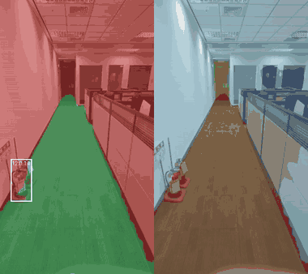

# How to train a vision multi-head network

*An internal walkthrough, using SyncAI-Lib-HydraNet as the worked example. Written for
everyone who touches the perception stack — you do not need an ML background to follow it,
but you do need to care about why the robot walks into a glass door.*

Sections 1–8 are **why it is shaped this way and which measurements lie**; section 9 is
**how to actually run it** (merged in from `USAGE.md` on 2026-08-19). For dividing the work
across a team, see [METHODOLOGY.md](METHODOLOGY.md).

---

## 1. What we are actually building

A quadruped walking through a lobby needs three different questions answered about the same
camera frame, at the same instant:

| Question | Output shape | Called |
|---|---|---|
| Can I put a foot here? | one label per pixel, 3 classes | traversability |
| What is this surface made of? | one label per pixel, 12 classes | terrain |
| Where are the people and objects? | a list of boxes | detection |

The first two are **segmentation**: the answer is a picture the same size as the input, where
every pixel carries a class. The third is **detection**: the answer is a variable-length list
of rectangles, each with a class and a confidence.

That difference matters more than it looks. Segmentation answers "what is *here*" for every
location, which is what you need to plan a footstep. Detection answers "how many of *those*
are in frame and where", which is what you need to avoid a person. Neither substitutes for
the other: a segmentation map does not tell you there are three people rather than one blob
of person-coloured pixels, and a box around a person tells you nothing about whether the
floor under them is wet.

### How to read the scores

Two numbers show up constantly, and it is worth knowing what they mean before they appear in
a review:

- **IoU** (intersection over union), per class: of all the pixels that are *either* predicted
  as `glass` or actually *are* `glass`, what fraction were both? 1.0 is perfect, 0.0 means no
  overlap at all. **mIoU** is the mean of that across classes.
- **mAP** for detection: roughly, how well the boxes are ranked and placed. Same direction —
  higher is better.

The trap in mIoU is that it is a *mean over classes*, not over pixels. In an indoor frame,
floor and wall are most of the image and `glass` might be 1% of it. A model that gets glass
completely wrong loses very little mIoU, because glass is one class out of twelve regardless
of how few pixels it holds. **That is exactly backwards from what we care about** — glass is
the most dangerous class we have, because it reads as an open corridor. This is why we look
at per-class IoU curves, not just the mean, and why `primary_metric` can be pointed at a
single class.

---

## 2. Why one network instead of three

The naive approach is three models: one per task. It works, and we did not do it.

The reason is the shape of the cost. Almost all of the computation in a vision network goes
into extracting general-purpose features — edges, textures, materials, shapes. Those features
are not task-specific. The parts that *are* task-specific are small.

Measured on our current model:

| Component | Role | Parameters | Share |
|---|---|---|---|
| RegNetX-800MF backbone | shared | 6,586,656 | 79.2% |
| BiFPN ×2 neck | shared | 435,686 | 5.2% |
| Detection head (FCOS) | task | 738,618 | 8.9% |
| Terrain head | task | 278,028 | 3.3% |
| Traversability head | task | 277,443 | 3.3% |
| **Total** | | **8,316,434** | |

**84.4% of the network is shared; the three heads together are 15.6%.** Three separate models
would mean paying that 84.4% three times, and running it three times per frame on a Jetson
with a fixed power budget.

The architecture that follows from this is the "HydraNet" shape — one trunk, many heads:

- **Backbone** (RegNetX): consumes the image, emits features at four resolutions — 1/4, 1/8,
  1/16, 1/32 of the input, getting deeper and more abstract as they get smaller.
- **Neck** (BiFPN): mixes information *across* those resolutions, so the fine-detail level
  knows what the coarse level saw, and vice versa. Out come five levels, P3 (1/8) through
  P7 (1/128), all 96 channels wide.
- **Heads**: each reads the levels it needs and nothing else. The segmentation heads take
  P3–P5 (the high-resolution ones — they must produce a full-size mask). The detection head
  takes all five, because objects come in wildly different sizes and each level specialises
  in a size range.

The rule that keeps this maintainable: **heads never read each other's output.** Only the
neck's features. That means a head can be added, removed or retrained without touching the
others, and a fourth head (depth, say) costs 3–9% more parameters rather than another 100%.

---

## 3. The hard part is not the architecture

Architectures are the easy half. You can copy one from a paper in an afternoon. What actually
consumes the schedule is that **no single dataset labels all three tasks.**

We have segmentation labels for indoor scenes (ADE20K), segmentation labels for off-road
(RUGD, RELLIS-3D), and detection labels for everything (COCO). Not one of them labels both.
There is no dataset where the same image has a traversability mask *and* boxes.

The standard wrong answer is to only train on data labelled for everything, which here means
training on nothing. The approach that works is **partial supervision**:

> Each training step draws a batch from *one* dataset, runs the full network, and
> backpropagates only the losses for the heads that dataset supervises.

A COCO batch produces a detection loss; the segmentation heads produce output that is simply
not scored, so no gradient flows into them. An ADE20K batch does the reverse. The shared
trunk receives gradient from *both*, which is the entire point — it gets to learn from all
the data, while each head only learns from data that actually answers its question.

In the config this is one line per dataset:

```yaml
- name: coco
  supervises: [detection]
- name: ade20k
  supervises: [traversability, terrain]
```

Two consequences to keep in mind:

1. **Sampling ratio is a real knob.** Steps per epoch is `Σ len(loader_i) × ratio_i`. COCO has
   ~117,000 images; at ratio 1.0 it will dominate every epoch and the segmentation heads will
   see comparatively little. We run COCO at a reduced ratio, and each epoch takes a different
   random slice, so nothing is permanently discarded.
2. **A head with no dataset is silently useless.** If nothing supervises detection, the head
   still gets built and still outputs numbers — they are just the initial random weights.
   The config check warns about this at startup, and you should read that warning rather
   than scroll past it. It is no longer only a warning: **`hydranet-export-onnx` refuses**
   an unsupervised head, which is one of the three gates `scripts/release_bundle.sh` runs
   ([RELEASE.md](RELEASE.md) §2). COCO has since been downloaded and the indoor config's
   detection head is supervised, so the example this item was written from no longer
   applies — the mechanism it describes still does.

### One annotation, two heads

Here is a trick worth stealing. We do not annotate traversability separately. Terrain labels
already contain the information — if a pixel is `wet_slippery`, whether it is walkable is a
*policy decision*, not a new labelling job. So we keep an explicit mapping table:

```python
INDOOR_TERRAIN_TO_TRAV = {
    1: 2,   # floor_hard      -> go
    4: 1,   # wet_slippery    -> caution
    8: 0,   # glass           -> blocked
    ...
}
```

One annotation pass, two supervised heads. And when the platform changes — a gait that
handles stairs, a foot that fits through grating — you change a policy table and retrain, not
your entire label set. Put that table in the annotation spec so annotators and training
cannot drift apart.

---

## 4. Balancing three losses

Three heads means three loss terms, and they are not on the same scale. A segmentation
cross-entropy and a detection focal loss produce numbers of different magnitudes, and if you
simply add them, whichever is numerically larger silently becomes the network's real
objective.

You have two options:

- **Fixed weights.** Simple, predictable, and you tune them by hand. Fine when you know what
  you want.
- **Learned uncertainty weighting** (Kendall et al.). The network learns one scalar per task
  representing how noisy that task is, and down-weights tasks it cannot predict reliably.
  Three extra parameters total.

We default to the learned version, with one important operational caveat: **watch the weights
during training.** They are logged as `task_weight/*`. If one task's weight collapses toward
zero, that head has effectively stopped learning and the trunk is being optimised for the
other two. That is a real failure mode that looks fine in the total loss curve.

---

## 5. The traps that actually cost us time

Every one of these is a real thing that happened, not a hypothetical.

### Validation weights are not the weights you trained

We keep an EMA — an exponential moving average of the weights — because averaging over
training reduces noise and usually validates better. But the average *starts from the model's
random initialisation*, and with a fixed decay it takes thousands of steps to forget it.

On a short run we measured traversability mIoU of **0.16** with EMA and **0.95** from the
exact same training without it. Nothing was wrong with the training; we were validating a
weighted blend of a trained model and random noise.

The fix is to ramp the decay with the update count, so the early average is nearly a straight
copy of the model and smoothing strengthens as history accumulates. That is in place now. The
general lesson is broader than EMA: **know which weights your validation number came from.**

### Whichever metric picks the model *is* your objective

`best.pt` is whichever epoch scored highest on one number. If nobody chooses that number
deliberately, it defaults to something reasonable-sounding, and the entire run silently
optimises for it.

Make it explicit and make it match the mission. If the thing that strands a robot is walking
into glass, then select on glass:

```yaml
primary_metric: IoU/traversability/00_blocked
```

A typo here aborts the run and lists the valid keys — deliberately, because the alternative
is discovering after 14 hours that you selected on the wrong quantity.

### A default that is always overridden is not a default

Every run this project has produced was launched with `--set train.batch_size=48
train.lr=6.0e-4 train.amp_dtype=bfloat16 ...`. The values sitting in the YAML files were
therefore never the values that trained anything, and two of them had drifted into being
wrong without a single symptom.

**The learning rate does not travel alone.** Our runs all sit on `lr = batch_size ×
1.25e-5` — 48 → 6.0e-4, 32 → 4.0e-4, 16 → 2.0e-4. `hydranet_indoor.yaml` lowered
`batch_size` to 8 for laptops and inherited the base's `2.0e-4`, which had been chosen
for a batch of 16. The config asked for double the rate of every run we have ever done.
Nobody could see it, because nobody ever ran it.

**The precision nothing was trained in.** No config set `amp_dtype`; the code fell back
to `float16`; all nine runs used bfloat16 from the command line. So the one path a
newcomer takes — `hydranet-train --config` — used a precision we have never trained in,
on a detection loss whose one AMP bug is reachable only under autocast.

Both are fixed, and `tests/test_config_defaults.py` now checks the shipped configs
rather than trusting them. The transferable part: if you find yourself overriding the
same key on every launch, the file is no longer describing your experiment, and the
gap is only ever discovered by whoever runs it without your command line.

### Random train/val splits will lie to you

RUGD and RELLIS ship no official split, and your own footage certainly does not. If you split
frames randomly, frame 1041 lands in train and frame 1042 in val — and they are nearly the
same picture. Your validation score then measures memorisation, and it will look excellent.

**Split by sequence, or by recording session.** Always. The score will drop. That drop is not
a regression; it is the first honest number you have had.

### val is optimistic about itself

`best.pt` is the epoch that scored best *on val*. Reporting that val score as the model's
performance is circular — you picked the winner using that exact measurement. For a number
you would defend to a customer, you need a third split that no part of training ever reads:

```bash
hydranet-eval --config ... --checkpoint ... --split test
```

We deliberately do not default `split_test` to val. If it is not configured, asking for it
fails loudly, because a silent fallback here produces an official-looking number that is
quietly wrong.

And a split stays held out only for as long as the directory it lives in does.
`hydranet-prepare-ade20k --test-fraction` used to leave an existing `test/` in place when
re-run without the flag — which defaults to 0, so simply omitting it was enough — while
rebuilding `val/` over every kept frame. The held-out images ended up in both, silently.
Fixed, but the general point survives the fix: **rebuilding a dataset can undo a split
without touching any code**, and nothing downstream can tell. After regenerating, check
that the splits are still disjoint:

```bash
comm -12 <(ls datasets/ADE20K/images/val | sort) <(ls datasets/ADE20K/images/test | sort) | wc -l
```

### Aspect ratio

If the camera is 9:16 and the network input is 4:5, naively resizing squeezes the image more
than 2× horizontally. Every learned notion of shape breaks. Turn on `letterbox: true` and the
padding gets labelled *ignore* so it contributes no loss.

---

## 6. What to look at while it trains

The loss curve tells you almost nothing beyond "it has not diverged". Three things are worth
more:

1. **The prediction images.** Every validation writes an `input | prediction | label`
   triptych to TensorBoard. This is the single highest-value signal available: a falling loss
   is compatible with the model calling an entire floor a wall, and you will see that
   instantly in a picture and never in a curve.
2. **Per-class IoU**, not just mIoU — for the reason in section 1. Watch the rare, dangerous
   classes specifically.
3. **Throughput (img/s).** If it is well below what the hardware should do, you are not
   compute-bound, you are waiting on data loading. That is a different fix (more workers,
   smaller images offline) and no amount of model tuning will help.

And know when to stop tuning. If `caution` will not move — ours went from 0.200 to 0.229
after a move to a GPU ten times faster and three times the epochs, while every other
traversability class scores above 0.84 — the question to ask is not "which learning rate" —
it is "how many examples of `caution` are actually in the
training data?" In our case: of the four terrain classes that map to caution, ADE20K contains
exactly one, at 0.3% of pixels. **That is a data acquisition problem wearing a training
problem's clothes,** and no hyperparameter fixes it.

---

## 7. Make every run answerable

Six weeks after a run, someone will ask what produced a checkpoint. If the answer requires
memory, the answer is lost.

Every run here writes:

```text
runs/<experiment>/
├── meta.json          git commit, dirty flag, environment, dataset fingerprints, full config
├── config.yaml        the config after --set overrides, ready to re-run
├── uncommitted.patch  the working-tree diff, when there was one
├── metrics.jsonl      one line per validation
├── train.log
└── tb/
```

Two of those are less obvious and both earn their place. **`uncommitted.patch`** exists
because a commit hash does not restore code that was never committed, and real training runs
happen on dirty working trees. **Dataset fingerprints** — file counts, sizes, a digest of the
path listing — exist because the data changes more often than the code, and "same config,
different result" is almost always the data.

Then `hydranet-report` reads it back:

```bash
hydranet-report runs/*  --diff     # rank the runs, and show what differed between them
```

We do not run an experiment tracking server (MLflow, W&B). For one machine, files plus
TensorBoard cover it, and the provenance above is better than a tracker's defaults. The point
at which that stops being true is when training spans two machines and there is no single
place to compare them — which is roughly where we are now, so expect this to be revisited.

---

## 8. The order to do things in

If you are picking this up and training a multi-head network from scratch:

1. **Get one head working end to end first.** Data → training → a validation number → a
   picture of a prediction. Do not add head two until head one is honestly scoring.
2. **Prove the loop, not the architecture.** Overfit a single batch deliberately. If the
   network cannot drive four fixed images to near-zero loss, something is disconnected, and
   no amount of data will reveal which. Our test suite does this on every commit.
3. **Add heads one at a time**, and after each, check the task weights and confirm the
   existing head did not regress.
4. **Fix the splits before trusting any number.** Sequence-level, with a test split you do
   not touch.
5. **Choose `primary_metric` deliberately** before the first long run.
6. **Then** tune hyperparameters — and only for things the data can actually support.

The recurring theme: most of what looks like a modelling problem is a data or measurement
problem. The architecture is 15.6% of the parameters and considerably less than that of the
difficulty.

---

*Related: [DEPLOY.md](DEPLOY.md) for local development, [the CUDA move](journal/2026-08-12-mps-to-cuda.md)
for moving to a CUDA machine, [DEPLOY.md](DEPLOY.md) for deployment. The
architecture diagram and per-component parameter counts are in the
[README](../README.md).*


---

## 9. Running it

| Dataset | Used for | Download |
|---|---|---|
| ADE20K | Indoor terrain / traversability | <https://groups.csail.mit.edu/vision/datasets/ADE20K/> |
| RUGD | Off-road terrain / traversability | <http://rugd.vision/> |
| RELLIS-3D | Off-road terrain / traversability | <https://github.com/unmannedlab/RELLIS-3D> |
| COCO 2017 | Object detection | <https://cocodataset.org/#download> |

Expected layout:

```text
datasets/
├── ADE20K/                                # produced by hydranet-prepare-ade20k
│   ├── images/{train,val}/**.jpg
│   └── annotations/{train,val}/**.png     # single channel, integers 0..150
├── RUGD/
│   ├── images/{train,val}/**.png
│   └── annotations/{train,val}/**.png     # RGB palette
└── coco/
    ├── train2017/  val2017/
    └── annotations/instances_{train,val}2017.json
```

RUGD and RELLIS ship no official train/val split — split them by sequence, or the same
sequence leaks across both sides. The same goes for your own footage: split by **recording
session**, because adjacent frames are near-identical and a random split will badly
overstate performance.

Just want to get something running? Trim `data.datasets` down to whatever you actually
have — the heads are still built, they just go unsupervised (startup warns you which head
nobody is supervising).

### Three splits

The rules are in [METHODOLOGY.md](METHODOLOGY.md) §2; the config is three keys:

```yaml
- name: ade20k
  split_train: train
  split_val: val
  split_test: test        # optional, and deliberately not defaulted to val
```

```bash
uv run hydranet-eval --config ... --checkpoint ... --split test
```

Passing `--split test` without a configured `split_test` fails loudly and tells you what to
create; it never falls back to val silently.

### Data versioning

Datasets are not in git and there is no DVC. Instead, every training run writes a
**fingerprint** of each split (file count, total bytes, digest of the path-and-size listing)
into `runs/<experiment>/meta.json`, so any checkpoint can answer "which data was I trained
on?". Re-export the annotations, add a few hundred site photos, or change a filter
threshold, and the two runs' fingerprints differ.

### The ADE20K indoor subset

ADE20K's 20k images span 1055 scene categories, most of them outdoor. The command below
filters on **annotation content** (enough floor, little sky and vegetation) to select the
ground-level indoor viewpoint a robot actually sees:

```bash
uv run hydranet-prepare-ade20k \
    --src datasets/ADEChallengeData2016 --dst datasets/ADE20K
# training   -> train: kept 5998/20210 (29.7%)
# validation -> val:   kept  614/2000  (30.7%)
```

The output is symlinks, so it costs no extra disk and re-running is cheap.

## Training

```bash
uv run hydranet-train --config configs/hydranet_indoor.yaml

# override any setting (dot-path)
uv run hydranet-train --config configs/hydranet_indoor.yaml \
    --set train.batch_size=8 model.neck.name=fpn 'data.input_size=[384,512]'

# resume: the schedule continues from where it stopped, it does not replay
uv run hydranet-train --config ... --resume runs/hydranet_indoor/last.pt
```

Training features: AMP mixed precision (`train.amp_dtype` accepts `bfloat16`), cosine +
warmup, EMA (the decay ramps up, so short runs are safe too), a lower learning rate for the
backbone, gradient accumulation, and best/last checkpoints.

Typos in `--set` are not swallowed: the config is validated as a whole after the overrides
are applied, and unknown keys, type mismatches, a `supervises` entry pointing at a
non-existent head, or a `terrain_classes` count that disagrees with the head are all listed
at once before anything aborts.

### Out of VRAM? Accumulate gradients

```bash
--set train.batch_size=4 train.grad_accum_steps=4     # effective batch 16
```

The schedule, EMA and `global_step` all advance per optimizer step, so when you move to a
different machine you only need to keep `batch_size × grad_accum_steps` constant and the
learning rate carries over unchanged.

### Which metric picks the model

`train.primary_metric` names the single number that decides `best.pt`; the default is
`traversability_mIoU`. Any key validation emits works, including per-class ones:

```yaml
primary_metric: IoU/traversability/00_blocked   # the class that actually strands a robot indoors
```

A misspelled metric name aborts and lists every available key — rather than quietly
selecting the model on some other criterion for a whole run.

### What each run leaves behind

```text
runs/<experiment>/
├── meta.json          git commit, dirty flag, environment, dataset fingerprints, full config
├── config.yaml        config snapshot after --set, ready to re-run directly
├── uncommitted.patch  only when the working tree had uncommitted changes (a commit hash
│                      alone cannot restore the code)
├── metrics.jsonl      one line per validation, machine-readable
├── train.log
└── tb/
```

If a directory of that name already holds results, the new run writes to a timestamped
sibling instead: it will not overwrite an existing `best.pt`, and it will not mix two runs'
TensorBoard events together. To continue a run, use `--resume` (which lists, item by item,
any setting that differs from the one stored in the checkpoint).

These files exist precisely so `hydranet-report` can read them:

```bash
uv run hydranet-report runs/hydranet_indoor        # detail and curves for one run
uv run hydranet-report runs/* --diff               # ranking across runs + config differences
```

```text
run                          commit    epochs  best      @epoch  metric
-----------------------------------------------------------------------
indoor-b                     eaba6b8e  40      0.6412    37      traversability_mIoU
indoor-a                     3c12224f* 40      0.5980    31      traversability_mIoU

indoor-a -> indoor-b
  train.lr: 0.0002 -> 0.0004
```

The `*` after a commit means that run's working tree was dirty.

### Watching a run

```bash
uv run tensorboard --logdir runs/
```

Beyond loss curves, TensorBoard also receives:

- **`val_pred/*` comparison images** — each validation writes an "input | prediction |
  label" triptych. Grey is letterbox padding, black is the ignore region. A curve only tells
  you the loss is going down; this is what shows you the model is calling an entire floor a wall.
- **`IoU/<head>/<class>`** — per-class IoU. Indoors, the classes that matter most (glass,
  stairs) occupy a tiny pixel fraction, and mIoU alone lets the large classes hide them.
- **`task_weight/*`** — the `exp(-s)` learned by uncertainty weighting, which shows which
  task is dominating the trunk's gradients. A head collapsing toward zero has effectively
  stopped learning.

## Evaluation and inference

```bash
uv run hydranet-eval --config ... --checkpoint runs/.../best.pt

# report final numbers on the held-out test split, as JSON for cross-run comparison
uv run hydranet-eval --config ... --checkpoint runs/.../best.pt \
    --split test --json reports/best_test.json

uv run hydranet-infer-image --config ... --checkpoint runs/.../best.pt \
    --input photo.jpg --output out/

uv run hydranet-infer-video --config ... --checkpoint runs/.../best.pt \
    --input clip.mp4 --output clip_pred.mp4 --fps 10
```

`--layout` takes four values. `side` (the default) writes traversability on the left and
terrain on the right; `trav` and `terrain` write one of them full-frame; and **`quad`**
adds the depth head as a fourth pane.

Two things about `quad` are decisions rather than details. Its depth ramp is **fixed, never
per-frame** — anything past the ends is clamped, so a frame that saturates *looks*
saturated instead of looking like a different scene, which is what per-frame
renormalisation would make it. `--depth-max` sets the far end and defaults to the head's own
`max_depth`, the range it was trained to emit; an indoor corridor spends all of that in its
first fifth, so a smaller value usually reads better. And `quad` **exits** on a config with
no depth or traversability head rather than drawing an empty pane.

`side` writes traversability on the left and terrain on the right, both from the same
forward pass:



An office corridor on the 60-epoch multi-task checkpoint. Floor, wall and partition are
solid because those are the classes ADE20K has in quantity; the same model scores
`caution` 0.33 and `stairs` 0.32 on the test split, and returns a quarter of a ceiling as
"go". Watch a clip before trusting a number — a curve cannot show you a model calling a
ceiling a floor, and this is the cheapest way to find it.

### The floor in metres

```bash
uv run hydranet-scene --config ... --checkpoint runs/.../best.pt \
    --input clip.mp4 --output clip_bev.mp4

# the scene as data rather than a picture: one JSON object per frame
uv run hydranet-scene --config ... --checkpoint ... --input frame.jpg --json scene.json
```

Camera view on the left, the floor rebuilt in metres on the right, with each detection
placed where its box meets the ground. It needs a camera pose and does not have one, so it
takes `--camera-height` (1.5 m), `--pitch` (15° down) and `--vfov` (55°) and **prints them
on every frame**: get any of them wrong and every distance is off by a smooth factor that
looks entirely plausible. `--range` sets how far out to map.

Those three numbers are assumptions for archived footage and a phone video. On a fixed
camera, `scripts/fit_camera_from_people.py` recovers height and pitch by fitting detected
people against a 1.70 m adult; pass the result with `--pose-note` so the caption stops
claiming a guess. [GROUND_PROJECTION.md](GROUND_PROJECTION.md) is what the projection does
and what survives the assumption.

### Deploying

Export, engine build and board bring-up are [DEPLOY.md](DEPLOY.md). The one thing to know
from here: `hydranet-export-onnx --check-parity` is the acceptance gate, and it runs on CPU
so any machine can produce the ONNX.
